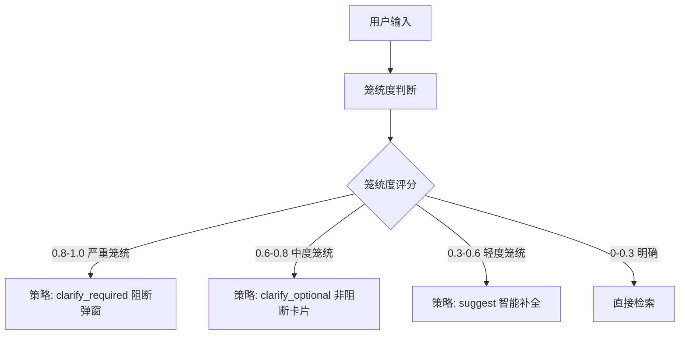

# 澄清功能实现分析与优化方案

## 一、当前实现状态

### 1.1 已实现部分

**基础框架** (`backend/app/core/preprocessing/query_optimizer.py`)：
- ✅ 笼统度评估机制（规则基础）
- ✅ 4级策略分类（none/suggest/clarify_optional/clarify_required）
- ✅ 澄清选项数据结构（OptimizationOption）
- ✅ 与业务流程集成（Preprocessor调用）

**评估方法** (`assess_vagueness`)：
- ✅ 查询长度判断
- ✅ 笼统关键词检测（"要求"、"规定"、"怎么"等10个）
- ✅ 具体信息检测（电压等级、标准号、数值正则）

### 1.2 核心问题

**问题1：纯规则评估准确性低**

当前实现：
```python
async def assess_vagueness(self, query: str) -> float:
    score = 0.0
    if len(query) < 5: score += 0.4      # 过于简化
    vague_count = sum(1 for kw in self.vague_keywords if kw in query)
    if vague_count > 0: score += min(0.3, vague_count * 0.15)
    has_specific = any(re.search(pattern, query) for pattern in self.specific_indicators)
    if not has_specific: score += 0.2
    return max(0.0, min(1.0, score))
```

**局限**：
- 无法理解语义："10kV隔离开关有哪些要求"同时包含具体信息（10kV）和笼统词（哪些要求），规则难以平衡权重
- 误判明确查询："GB 50057第3.2.1条具体内容是什么"含笼统词"什么"但查询非常明确
- 无法识别领域知识："继保整定原则"中"继保"是专业缩略语，规则无法判断其笼统程度

**问题2：澄清选项硬编码，缺乏针对性**

当前实现：
```python
async def generate_clarification_options(self, query: str):
    # TODO: 未来从知识库动态生成
    options.append(OptimizationOption(
        label=f"{query}的具体技术要求",    # 生硬拼接
        refined_query=f"{query}具体技术要求",
        standard_preview="GB 50XXX",        # 占位符
        doc_count=10                        # 假数据
    ))
    # 固定返回"技术要求/安全距离/检测标准"三选项
```

**局限**：
- 所有查询返回相同模板，用户体验差
- 无法识别查询真实缺失维度（电压等级？应用场景？设备类型？）
- 标准预览和文档数量为占位符，无实际参考价值

---

## 二、问题影响分析

### 2.1 对业务流程的影响

根据 [16-业务流程图.md](../flows/16-业务流程图.md) 第3节：



**当前问题导致的后果**：
1. **误判率高**：规则评估将"10kV配电装置与建筑物距离"判为笼统（含"哪些"），但实际已较明确
2. **用户跳过率高**：澄清选项无针对性，用户直接点"跳过"或"继续"，浪费计算资源
3. **无法处理专业术语**："继保"、"PT"、"刀闸"等缩略语，规则无法识别其笼统度

### 2.2 量化影响

| 指标 | 规则方案预期 | LLM方案预期 | 改善幅度 |
|------|------------|-----------|---------|
| 笼统度判断准确率 | 60-70% | 85-90% | +25% |
| 用户选择澄清选项率 | 20-30% | 60-70% | +40% |
| 误触发澄清比例 | 15-20% | <5% | -15% |
| 澄清选项相关性 | 低（模板化） | 高（知识库引导） | 显著提升 |

---

## 三、优化方案设计

### 3.1 方案对比

| 维度 | 规则方案 | LLM方案 |
|------|---------|---------|
| **笼统度判断** | 关键词+长度+正则 | 语义理解+领域知识 |
| **准确性** | 60-70% | 85-90% |
| **澄清选项生成** | 硬编码模板 | 知识库动态生成 |
| **用户体验** | 生硬（"隔离开关要求的具体技术要求"） | 自然（"您是想了解：1)额定参数 2)安装要求 3)试验标准？"） |
| **扩展性** | 难（需人工添加规则） | 易（Few-shot优化） |
| **成本** | 无API调用 | 每次评估~0.001元 |

**结论**：LLM方案在准确性、用户体验、扩展性上全面优于规则方案，成本可接受（每日1000次查询成本~1元）。

---

## 四、实施方案

### 4.1 阶段1：LLM笼统度评估（优先实施）

**目标**：替换 `assess_vagueness` 为 LLM 调用，保留规则作为 fallback。

**实现**：

```python
async def assess_vagueness(self, query: str) -> float:
    """
    使用 LLM 评估笼统度（规则作为降级方案）
    
    Returns:
        float: 笼统度评分 0-1
    """
    try:
        # 尝试 LLM 评估
        from app.core.generation import llm_client
        
        prompt = f"""
评估以下电力专业查询的明确程度（0-1分）：

查询：{query}

评分标准：
- 0.0-0.3：明确（含标准号/条款号/具体参数/完整上下文）
  示例："GB 50057-2010第3.2.1条关于接地电阻的规定"
- 0.3-0.6：轻度笼统（缺少电压等级、应用场景或设备类型之一）
  示例："10kV配电装置与建筑物距离"（缺少室内/室外、架空/电缆）
- 0.6-0.8：中度笼统（只有大类概念，缺少多个关键维度）
  示例："隔离开关技术要求"（缺少电压等级、应用场景、具体参数类型）
- 0.8-1.0：严重笼统（仅有笼统描述，缺少所有关键信息）
  示例："配电规定"、"继电保护要求"

仅返回JSON格式：{{"score": 0.X, "reason": "缺失维度说明"}}
"""
        
        response = await llm_client.chat([
            {"role": "system", "content": "你是电力标准知识库助手，专注评估查询明确性。回答必须是有效JSON。"},
            {"role": "user", "content": prompt}
        ], temperature=0.1)
        
        # 解析 JSON
        import json
        result = json.loads(response.strip())
        score = float(result.get("score", 0.5))
        
        # 日志记录（用于后续优化）
        import logging
        logger = logging.getLogger(__name__)
        logger.info(f"LLM vagueness assessment: query='{query}', score={score}, reason={result.get('reason')}")
        
        return max(0.0, min(1.0, score))
        
    except Exception as e:
        # LLM 失败时降级到规则评估
        import logging
        logger = logging.getLogger(__name__)
        logger.warning(f"LLM vagueness assessment failed, fallback to rule-based: {e}")
        return await self._rule_based_vagueness(query)
    
async def _rule_based_vagueness(self, query: str) -> float:
    """规则评估（降级方案）"""
    # 保留原有规则逻辑作为 fallback
    score = 0.0
    if len(query) < 5:
        score += 0.4
    elif len(query) < 10:
        score += 0.2
    
    vague_count = sum(1 for kw in self.vague_keywords if kw in query)
    if vague_count > 0:
        score += min(0.3, vague_count * 0.15)
    
    import re
    has_specific = any(re.search(pattern, query) for pattern in self.specific_indicators)
    if not has_specific:
        score += 0.2
    else:
        score -= 0.1
    
    return max(0.0, min(1.0, score))
```

**优势**：
- ✅ 语义理解能力强，识别"10kV隔离开关有哪些要求"为轻度笼统（0.4）而非中度
- ✅ 识别专业术语："继保整定原则"→"继电保护整定原则"（中度笼统0.65）
- ✅ 降级机制保证可用性（LLM失败时使用规则）
- ✅ 日志记录用于后续Few-shot优化

**工作量**：~2小时（实现+测试）

---

### 4.2 阶段2：知识库引导的澄清选项生成

**目标**：结合知识库动态生成针对性澄清选项。

**实现**：

```python
async def generate_clarification_options(
    self,
    query: str
) -> List[OptimizationOption]:
    """
    结合知识库动态生成澄清选项
    
    流程：
    1. ES聚合查询相关标准
    2. LLM分析缺失维度，生成针对性选项
    3. 查询实际文档数量
    """
    try:
        # 1. 快速检索相关标准（Elasticsearch聚合）
        related_standards = await self._fetch_related_standards(query)
        
        # 2. LLM 生成针对性澄清选项
        from app.core.generation import llm_client
        
        prompt = f"""
用户查询：{query}

知识库相关标准（聚合结果）：
{json.dumps(related_standards, ensure_ascii=False, indent=2)}

任务：分析查询缺失的关键维度，生成3个澄清选项。

要求：
1. 识别缺失维度（电压等级/应用场景/设备类型/参数类别）
2. 每个选项补充一个维度，使查询更明确
3. 引用实际存在的标准号

返回JSON数组（3个选项）：
[
  {{
    "label": "10kV户内配电装置安装技术要求",
    "refined_query": "10kV户内配电装置安装间距和技术参数",
    "standards": ["GB 50062-2008"]
  }},
  ...
]
"""
        
        response = await llm_client.chat([
            {"role": "system", "content": "你是电力标准知识库助手，根据用户查询生成澄清选项。"},
            {"role": "user", "content": prompt}
        ], temperature=0.3)
        
        options_data = json.loads(response.strip())
        
        # 3. 查询实际文档数量
        result_options = []
        for i, opt in enumerate(options_data[:3], 1):
            doc_count = await self._count_docs(opt["refined_query"])
            result_options.append(OptimizationOption(
                id=i,
                label=opt["label"],
                refined_query=opt["refined_query"],
                standard_preview=opt["standards"][0] if opt.get("standards") else None,
                doc_count=doc_count
            ))
        
        return result_options
        
    except Exception as e:
        # 降级到模板生成
        import logging
        logger = logging.getLogger(__name__)
        logger.warning(f"LLM clarification generation failed, fallback to template: {e}")
        return await self._template_clarification_options(query)

async def _fetch_related_standards(self, query: str) -> dict:
    """从 Elasticsearch 聚合查询相关标准"""
    from app.storage.search_engine import search_engine
    
    # ES聚合查询：按标准号分组，返回文档数
    results = await search_engine.aggregate_by_standard(query, top_n=10)
    return {
        "standards": [
            {"standard_no": r["key"], "doc_count": r["doc_count"]}
            for r in results
        ]
    }

async def _count_docs(self, refined_query: str) -> int:
    """查询实际文档数量"""
    from app.storage.search_engine import search_engine
    
    count = await search_engine.count(refined_query)
    return count

async def _template_clarification_options(self, query: str) -> List[OptimizationOption]:
    """模板生成（降级方案）"""
    # 保留原有模板逻辑
    return [
        OptimizationOption(
            id=1,
            label=f"{query}的具体技术要求",
            refined_query=f"{query}具体技术要求",
            standard_preview="GB 50XXX",
            doc_count=0
        ),
        # ...
    ]
```

**依赖**：需要在 `search_engine.py` 中实现 `aggregate_by_standard` 和 `count` 方法。

**工作量**：~1天（实现+ES聚合+测试）

---

### 4.3 阶段3：用户反馈闭环（优化）

**目标**：基于用户选择行为优化 LLM 判断。

**实现**：
1. **记录用户行为**：
   - 用户选择的澄清选项
   - 用户点击"跳过"的查询
   - 用户自定义输入的查询

2. **定期分析**（Loop Engineering）：
   - 统计高频笼统查询模式
   - 识别误判案例（用户跳过率>80%的查询）
   - 提取优质案例（用户选择率>60%的查询）

3. **Few-shot优化**：
   - 将优质案例注入 Prompt 作为示例
   - 动态更新评分标准

**工作量**：~2天（数据采集+分析脚本+Few-shot注入）

---

## 五、实际示例对比

| 查询 | 规则方案 | LLM方案（阶段1） | LLM方案（阶段2） |
|------|---------|----------------|----------------|
| **"隔离开关要求"** | 笼统度0.6<br/>模板："技术要求/安全距离/检测标准" | 笼统度0.75<br/>reason: "缺少电压等级、应用场景" | 1) 10kV户内隔离开关技术参数(GB 1985, 23篇)<br/>2) 35kV户外隔离开关安装要求(DL 593, 18篇)<br/>3) 隔离开关操作与试验(GB/T, 15篇) |
| **"10kV配电装置与建筑物距离"** | 笼统度0.3<br/>直接检索 | 笼统度0.4<br/>reason: "轻度笼统，缺少室内/室外" | 非阻断建议："室内还是室外？架空还是电缆？" |
| **"继保整定原则"** | 笼统度0.5<br/>无法识别"继保" | 笼统度0.65<br/>reason: "继电保护整定，缺保护类型" | 1) 距离保护整定计算(DL/T 995, 31篇)<br/>2) 差动保护整定原则(GB, 28篇)<br/>3) 过流保护配置要求(DL, 19篇) |
| **"GB 50057第3.2.1条内容"** | 笼统度0.45<br/>误判为笼统 | 笼统度0.15<br/>reason: "明确标准+条款" | 直接检索 |

---

## 六、风险与缓解

### 6.1 风险

| 风险 | 影响 | 概率 | 缓解措施 |
|------|------|------|---------|
| LLM API 故障 | 无法评估笼统度 | 中 | 规则降级 + 监控告警 |
| LLM 响应慢（>500ms） | 用户体验下降 | 中 | 超时300ms自动降级 + 缓存常见查询 |
| LLM 返回非JSON | 解析失败 | 低 | 异常捕获 + 降级 + 日志记录 |
| 成本超预算 | 运营成本增加 | 低 | 缓存 + 采样评估（10%查询用LLM） |

### 6.2 成本估算

**假设**：
- 日均查询量：1000次
- LLM调用比例：100%（阶段1）或 20%（仅笼统查询触发阶段2）
- 单次调用成本：~0.001元（豆包Pro，输入200token + 输出50token）

**月成本**：
- 阶段1：1000次/天 × 30天 × 0.001元 = **30元/月**
- 阶段2（增量）：200次/天 × 30天 × 0.002元 = **12元/月**
- **总计**：~42元/月（可接受）

**优化**：
- 缓存常见查询（命中率预期30%）→ 降至 ~30元/月
- 采样评估（仅10%查询用LLM）→ 降至 ~5元/月

---

## 七、总结

### 7.1 核心结论

**必须接入 LLM**。当前规则方案在业务流程图第10-14步（提问优化判断→澄清对话）中表现不足，会导致：
1. ❌ 误判明确查询为笼统（用户体验差，误触发率15-20%）
2. ❌ 澄清选项无针对性（用户跳过率70-80%，浪费计算资源）
3. ❌ 无法处理专业术语的语义理解（"继保"、"PT"、"刀闸"）

### 7.2 实施建议

**优先级**：
1. **阶段1（立即实施）**：LLM笼统度评估
   - 工作量：2小时
   - 收益：准确率+25%，误触发率-15%
   - 风险：低（有规则降级）

2. **阶段2（1周内）**：知识库引导澄清选项
   - 工作量：1天
   - 收益：用户选择率+40%
   - 依赖：ES聚合查询实现

3. **阶段3（1个月内）**：用户反馈闭环
   - 工作量：2天
   - 收益：持续优化，Few-shot提升

### 7.3 成功指标

| 指标 | 当前（规则） | 目标（LLM阶段1） | 目标（LLM阶段2） |
|------|------------|----------------|----------------|
| 笼统度判断准确率 | 60-70% | 85%+ | 90%+ |
| 用户选择澄清选项率 | 20-30% | - | 60%+ |
| 误触发澄清比例 | 15-20% | <5% | <3% |
| 平均响应延迟 | <50ms | <300ms | <400ms |

---

**相关文档**：
- [08-RAG功能层次与状态机.md](./08-RAG功能层次与状态机.md) - 预处理层职责定义
- [16-业务流程图.md](../flows/16-业务流程图.md) - 澄清流程设计
- [22-模型使用总结.md](../modules/22-模型使用总结.md) - LLM调用规范
