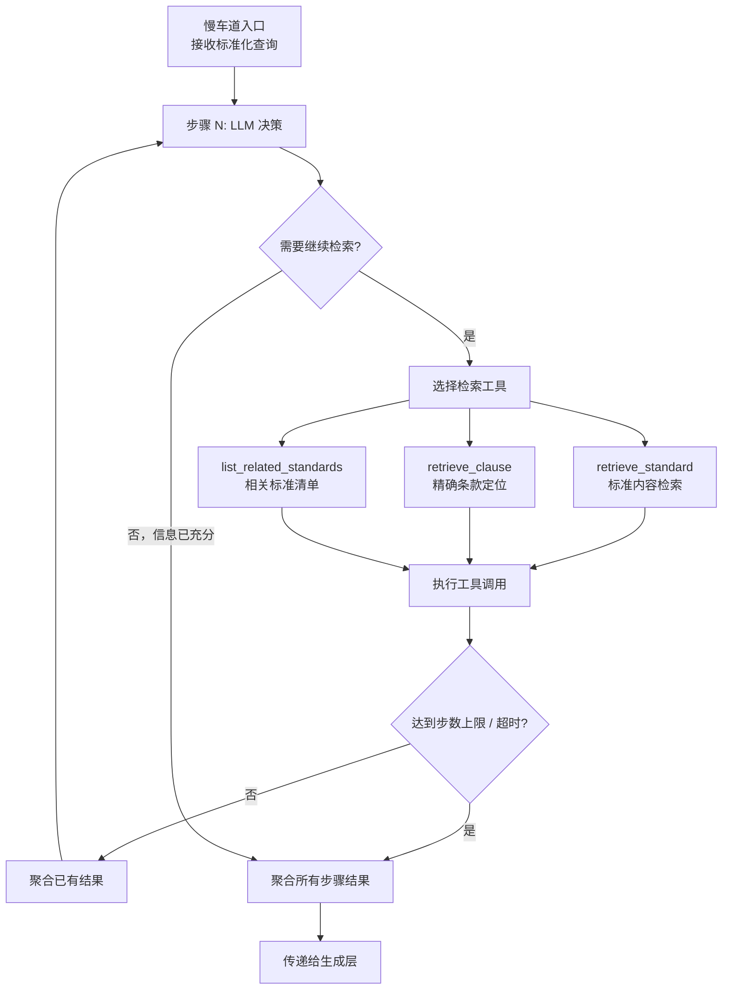

# 慢车道设计文档

> 对应层次：检索引擎层 → 慢车道（SlowLane）
> 关联文档：[08-RAG功能层次与状态机.md](./08-RAG功能层次与状态机.md) | [10-召回层设计.md](./10-召回层设计.md) | [12-RAG流程集成验证报告.md](./12-RAG流程集成验证报告.md) | [业务流程图](../flows/16-业务流程图.md)

---

## 一、定位与职责

慢车道是快慢双通道架构中的**兜底通道**，处理快车道固定流水线无法覆盖的复杂查询。设计原则是"有界自适应"：在步数上限和延迟预算的硬约束内，让 LLM 自主决策检索策略，完成需要多步推理才能回答的问题。

### 1.1 适用场景

| 场景类型 | 典型提问 | 不适合快车道的原因 |
|---------|---------|-----------------|
| 跨标准对比 | 异步发电机与变流器型光伏的功率因数要求有无区别？ | 需分别检索两类标准后对比 |
| 条款引用追溯 | GB/T 33593 引用了哪些其他标准的条款？ | 需先查引用关系，再取被引标准原文 |
| 多条件组合 | 35kV 变电站哪些条款同时涉及短路电流和接地？ | 多维度交叉无法单次召回覆盖 |
| 多跳推理 | 某设备满足 A 标准，是否也满足 B 标准的等效要求？ | 需多步推理，无固定检索路径 |

**流量比例**：慢车道预期承接 **< 10%** 的查询流量，剩余由快车道处理。

### 1.2 核心约束（硬性 SLA）

| 约束项 | 值 |
|-------|-----|
| 最大推理步数 | 3 步 |
| 单步超时 | 2000ms |
| 总延迟预算 | 8000ms |
| 独立限流 | QPS = 10 |
| P99 延迟目标 | ≤ 8s |

这些约束是设计的边界条件，实现时不得绕过。

---

## 二、在整体流程中的位置

```
预处理层（术语标准化 + 笼统度评估）
    ↓
路由层（Router）
    ├─→ 快车道（~90% 流量）
    └─→ 慢车道（~10% 流量）← 本文档
            ↓
        LLM 决策循环（最多 3 步）
            ↓
        生成层（AnswerGenerator）
```

慢车道跳过快车道特有的"查询改写 + 元数据提取"步骤，直接进入 LLM 决策循环。路由层的触发规则由 `Router` 负责（见 `retrieval/router.py`），慢车道本身不做路由判断。

---

## 三、整体处理流程



**关键设计决策**：
- 每步开始前，LLM 拿到"当前问题 + 已获取信息摘要"，决定是否继续及用什么工具
- 超时或到达步数上限时，强制聚合已有结果进入生成，不等待
- 信息充分时提前退出循环，不强制跑满步数

---

## 四、LLM 决策机制

### 4.1 决策输入

每次决策时，LLM 收到以下上下文：

- **原始问题**：用户提出的标准化查询
- **已执行步骤**：已调用过哪些工具、返回了什么（摘要形式，避免 token 膨胀）
- **可用工具列表**：工具名称 + 简短说明
- **剩余步数**：让 LLM 感知预算，避免无效消耗

### 4.2 决策输出

LLM 输出一个结构化结果，包含两个字段：

- `action`：`continue`（继续检索）或 `sufficient`（信息已够，进入生成）
- `tool_call`（仅 action=continue 时有效）：工具名 + 参数

### 4.3 超时降级

LLM 决策本身设置 **1.5s 超时**。超时后默认 `action=sufficient`，用已有结果直接生成。这与快车道充分性判断的超时策略保持一致。

---

## 五、工具集设计

慢车道共三个工具，对应不同的检索模式：

### 5.1 retrieve_standard — 标准内容检索

**职责**：对指定标准（可选）执行语义召回，返回最相关的内容块。

**内部实现**：复用快车道的 `MultiPathRecall`，传入 `standard_no` 过滤条件。这避免了重复实现召回逻辑，同时确保两通道的检索质量一致。

**输入参数**：
- `query`：本步骤的检索查询（可与原始问题不同）
- `standard_ids`（可选）：限定在哪些标准号中检索（`List[str]`）

**输出格式**：`List[ChunkResult]` — Top-N 相关文档块，与快车道召回格式完全一致

**典型使用场景**：
- 需要在特定标准里查找某类要求
- 第一步先不限定标准号，第二步根据第一步结果确定标准后再精查

---

### 5.2 retrieve_clause — 精确条款定位

**职责**：精确定位某标准的某条款，返回完整条款原文。

**内部实现**：直接查 MySQL `chunks` 表，按 `standard_no + clause` 精确匹配，零误差。

**输入参数**：
- `standard_id`：标准号（如 `GB/T 33593-2017`）
- `clause_number`：条款号（如 `5.1`）

**输出格式**：`List[ChunkResult]` — 包含该条款的单个 ChunkResult（列表长度为1）

**典型使用场景**：
- 第一步通过语义搜索发现某标准某条款可能相关
- 第二步用本工具拿到该条款的完整原文，避免截断

---

### 5.3 list_related_standards — 相关标准清单

**职责**：列出知识库中包含特定关键词的标准清单（标准号 + 标题），不返回内容。

**内部实现**：查 MySQL `documents` 表，按标题/关键词模糊匹配，返回文档元信息。

**输入参数**：
- `keyword`：关键词（如 `功率因数`、`户用光伏`）
- `category`（可选）：专业分类过滤

**输出格式**：`List[Dict]` — 标准元信息列表，**不是 ChunkResult 格式**

结构示例：
```json
[
  {
    "standard_no": "GB/T 33593-2017",
    "title": "分布式电源并网技术要求",
    "doc_count": 23,
    "doc_id": 48
  }
]
```

**典型使用场景**：
- 用户问"哪些标准规定了 X"时，先用本工具发现候选标准
- 再用 retrieve_standard 逐一查询具体内容

**聚合时的特殊处理**：此工具返回的是文档元信息而非 chunk，不参与最终的 chunk 聚合。其输出作为中间信息传给 LLM，辅助后续步骤的工具选择。

---

## 六、推理循环控制

### 6.1 终止条件（满足任一即终止）

1. LLM 判断信息已充分（`action=sufficient`）
2. 执行步数达到上限（3 步）
3. 累计耗时超过总延迟预算（8000ms）
4. 工具调用返回空结果且 LLM 无其他工具可选

### 6.2 步骤计数

步数以**工具调用成功次数**计，LLM 决策本身（未触发工具调用时）不计入步数。

### 6.3 单步超时处理

单步工具调用设置 2000ms 超时。超时后：
- 该步结果记为空
- 不中断循环，继续下一步决策（LLM 收到"该工具超时，无结果"的提示）
- 若已到步数上限则直接聚合进生成

---

## 七、信息聚合策略

多步骤的检索结果在进入生成层前需要聚合：

1. **工具输出分类**：
   - `retrieve_standard` 和 `retrieve_clause` 返回 `List[ChunkResult]`，直接参与聚合
   - `list_related_standards` 返回 `List[Dict]`（文档元信息），不参与 chunk 聚合，作为中间信息传给 LLM

2. **Chunk 聚合流程**：
   - **去重**：按 `chunk_id` 去重，同一内容块只保留一份
   - **排序**：按来源步骤的信息价值排序（靠后的步骤通常是精查，优先级更高）
   - **截断**：超出生成层 token 预算时，从低优先级结果截断

3. **输出格式统一**：聚合后的结果格式与快车道输出的 `rerank_results` 格式相同（`List[RerankResult]` 或其 dict 表示），生成层无需区分来源。

**推理链路记录**：每步的工具调用记录（工具名、参数、是否超时、返回块数）以列表形式一并传给生成层，用于生成带推理过程的答案或写入日志。

---

## 八、与快车道的复用关系

| 组件 | 慢车道是否复用 | 说明 |
|------|-------------|------|
| `MultiPathRecall` | ✅ 复用 | `retrieve_standard` 内部调用 |
| `QueryRewriter` | ❌ 不复用 | 慢车道由 LLM 决策查询，不做自动扩展 |
| `MetadataExtractor` | ❌ 不复用 | 过滤条件由 LLM 在工具参数中指定 |
| `TwoStageReranker` | ⚠️ 视情况 | 当前设计中不做重排，直接聚合；若性能允许可后续引入 |
| `SufficiencyChecker` | ❌ 不复用 | 充分性判断内嵌在 LLM 决策循环中 |
| `AnswerGenerator` | ✅ 复用 | 生成层完全共用 |

---

## 九、状态机集成

在查询状态机（见 `08-RAG功能层次与状态机.md`）中，慢车道对应 `REASONING` 状态：

```
ROUTING
  ↓（路由到慢车道）
REASONING          ← 整个 LLM 决策循环期间保持该状态
  ↓（循环结束）
GENERATING
  ↓
CITING
  ↓
COMPLETED
```

`REASONING` 状态持续整个推理循环（多步），不细分每步状态。若需要更细粒度的进度展示，通过日志子状态实现，不修改主状态机。

---

## 十、资源隔离与限流

慢车道不与快车道共享处理资源，原因：
- 单次慢车道请求可能消耗 3 次 LLM 调用 + 3 次召回，资源占用是快车道的 3-5 倍
- 若不隔离，慢车道的高延迟会阻塞快车道的处理队列

**隔离策略**：
- **独立限流**：慢车道 QPS 上限 10，快车道不受影响
  - 实现方式：Redis 滑动窗口计数器
  - Key 格式：`ratelimit:slow_lane:{timestamp_second}`
  - 限流粒度：全局限流（所有用户共享 10 QPS）
- **超限处理**：超出配额时返回 HTTP `429 Too Many Requests`，响应体提示：
  ```json
  {
    "error": "慢车道流量超限，请稍后重试或简化问题改用快车道",
    "retry_after": 1
  }
  ```

---

## 十一、可审计性要求

慢车道每次执行必须记录以下信息到 `query_logs`：

| 字段 | 内容 |
|-----|------|
| `lane` | `slow` |
| `conversation_id` | 会话ID（如支持多轮对话，用于关联上下文） |
| `retrieval_time` | 整个推理循环耗时（ms） |
| `recall_count` | 最终聚合的 chunk 数量 |
| `retrieved_chunk_ids` | 召回的 chunk IDs（JSON 数组） |
| `expanded_queries` | 各步骤传给工具的查询文本列表（JSON 数组），如 `["功率因数要求", "GB/T 33593 功率因数"]` |

**注**：`conversation_id` 字段已在数据库中使用，但尚未在 `06-数据模型设计.md` 中正式定义，建议更新数据模型文档补充该字段。

**推理链路追溯**（建议扩展）：

当前数据库 `query_logs` 表未定义专用字段存储工具调用序列。如需详细追溯慢车道推理过程，建议新增字段：

```sql
ALTER TABLE query_logs ADD COLUMN reasoning_steps JSON COMMENT '慢车道推理步骤详情（工具调用链路）';
```

字段结构示例：
```json
[
  {
    "step": 1,
    "tool": "list_related_standards",
    "params": {"keyword": "功率因数"},
    "elapsed_ms": 150,
    "result_count": 3
  },
  {
    "step": 2,
    "tool": "retrieve_standard",
    "params": {"query": "功率因数要求", "standard_ids": ["GB/T 33593-2017"]},
    "elapsed_ms": 800,
    "result_count": 15
  }
]
```

在未新增字段前，推理链路可通过 `expanded_queries` 字段部分还原（只记录查询文本，不含工具名）。

---

## 十二、路由规则优化建议

当前路由器（`retrieval/router.py`）将含"区别"的查询一律路由到慢车道。这会导致"有无区别"这类实际上可以在快车道完成的查询（两类信息在同一标准内，一次召回即可）进入空壳慢车道，返回空结果。

**建议改进**：路由规则细化，区分：
- **"有无区别"**（是非式对比）→ 快车道，通过扩展查询同时带入两个比较对象
- **"详细对比 A 和 B 的差异"**（深度分析式对比）→ 慢车道

改进前，实现慢车道是让"区别"类查询可用的前提。

---

## 相关文档

- [08-RAG功能层次与状态机.md](./08-RAG功能层次与状态机.md) — 状态机设计与各层接口规范
- [10-召回层设计.md](./10-召回层设计.md) — `MultiPathRecall` 实现细节（`retrieve_standard` 的底层依赖）
- [11-重排层设计.md](./11-重排层设计.md) — 重排与充分性判断（快车道部分，慢车道暂不复用）
- [业务流程图](../flows/16-业务流程图.md) — 慢车道在端到端流程中的位置
