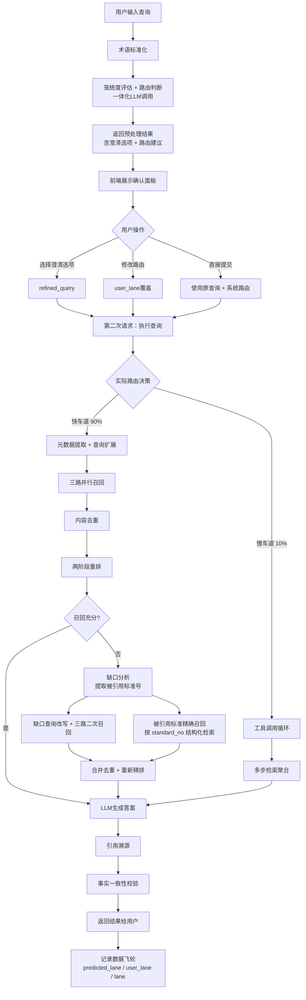
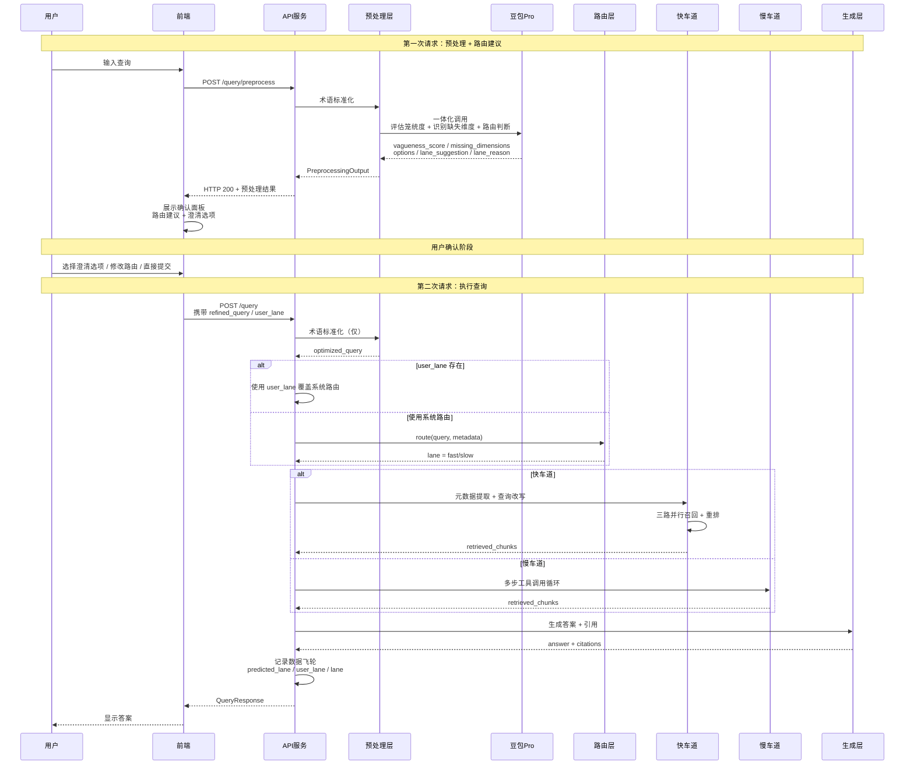
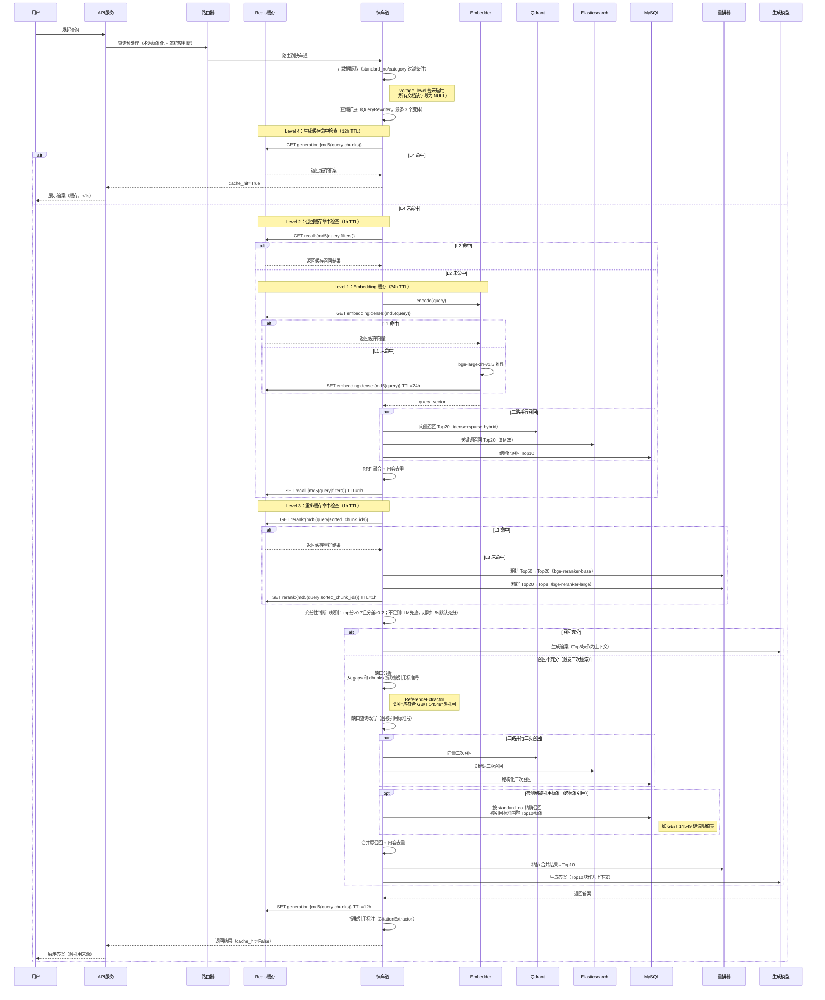
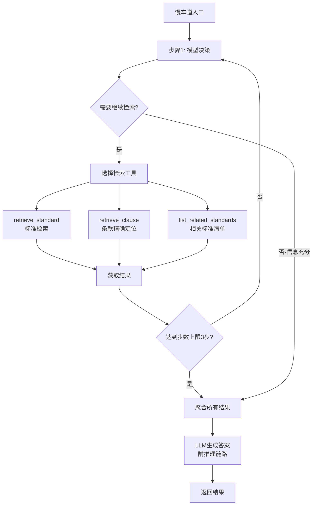
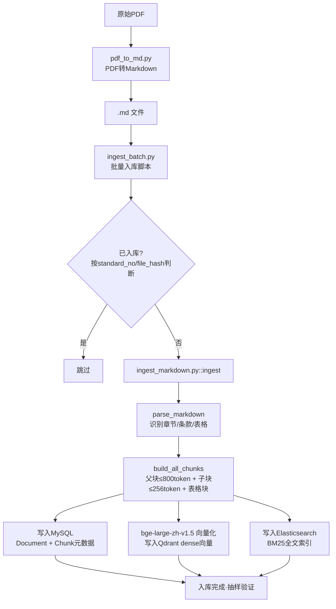
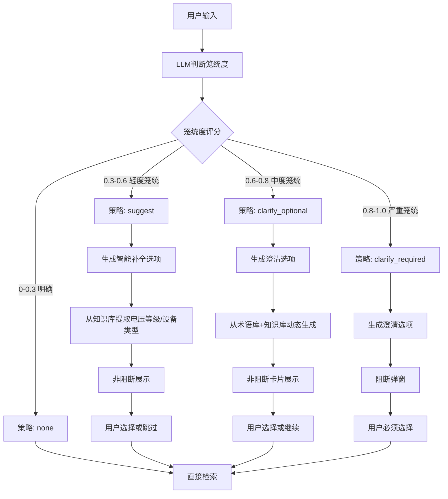
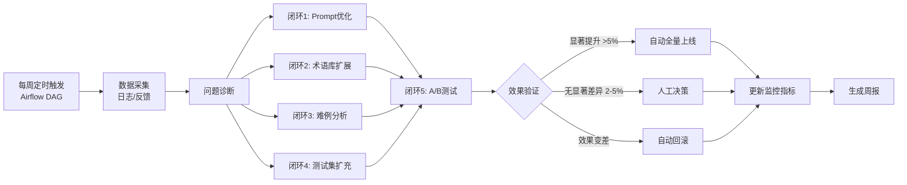
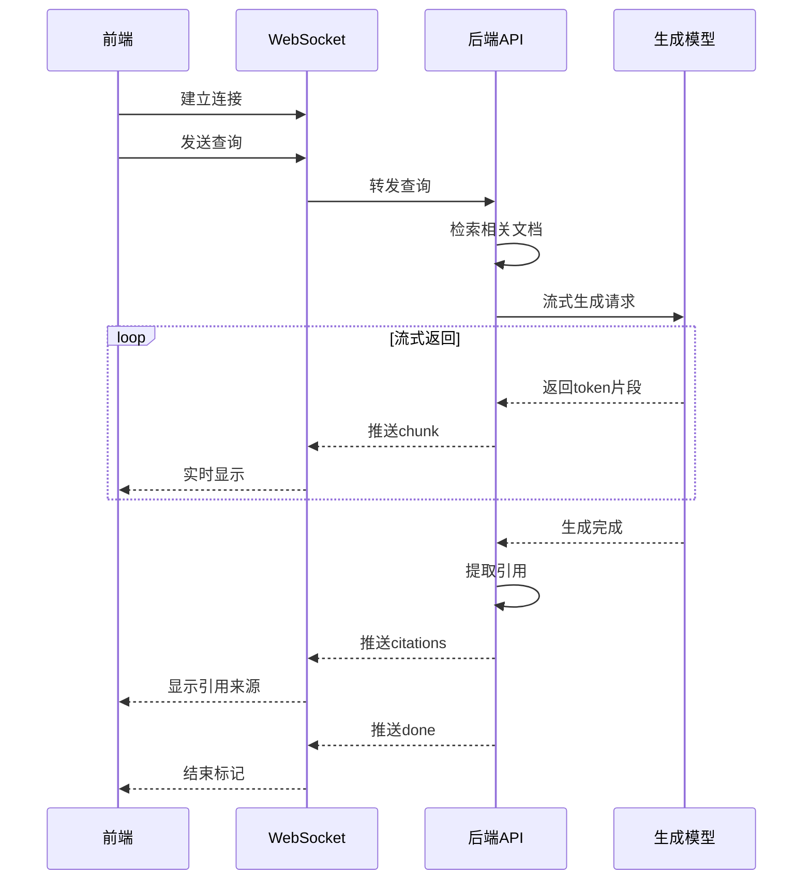
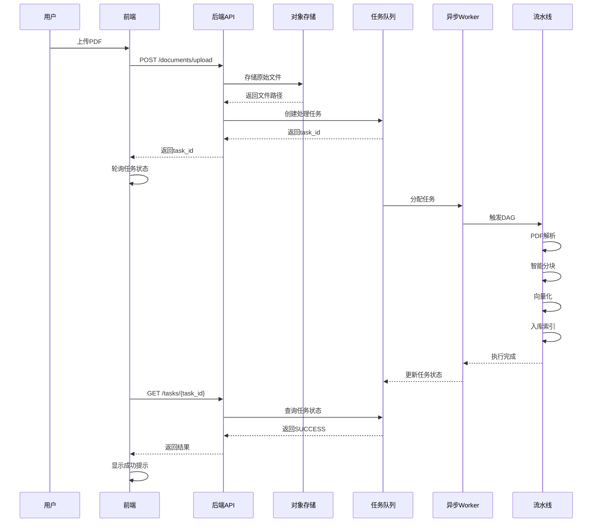

# 业务流程图

## 一、核心业务流程

### 1.1 用户查询流程（主流程 - 阶段B）



**阶段B关键变化**：
1. 术语标准化后立即进行一体化LLM调用（笼统度+路由判断）
2. 第一次请求返回预处理结果（非阻断，HTTP 200）
3. 前端展示确认面板，用户可修改路由或选择澄清选项
4. 第二次请求携带 `user_lane`（可选）执行实际检索
5. 数据飞轮记录三个字段：`predicted_lane`（LLM建议）、`user_lane`（用户覆盖）、`lane`（最终执行）

### 1.2 阶段B两次请求流程（序列图）



**关键时序**：
1. **第一次请求**：仅预处理，返回路由建议（不执行检索）
2. **用户确认**：前端展示面板，用户可修改
3. **第二次请求**：携带用户选择，执行实际检索
4. **数据飞轮**：每次查询记录 `predicted_lane`、`user_lane`、`lane` 三字段

### 1.3 快车道详细流程（含缓存层）



**缓存层说明**：
| 级别 | Key | TTL | 节省操作 |
|------|-----|-----|---------|
| L4 生成缓存 | `generation:{md5(query\|chunks)}` | 12h | 跳过全部检索+生成 |
| L3 重排缓存 | `rerank:{md5(query\|sorted_ids)}` | 1h | 跳过两阶段重排 |
| L2 召回缓存 | `recall:{md5(query\|filters)}` | 1h | 跳过三路并行召回 |
| L1 Embedding 缓存 | `embedding:dense:{md5(text)}` | 24h | 跳过向量化推理 |

**跨标准引用补充检索**：当充分性判断返回不充分时，快车道会从 `gaps` 和已召回块中提取被引用标准号（如 "应符合 GB/T 14549"），并额外按 `standard_no` 结构化召回被引用标准的实际内容。这样可以避免只回答"应符合某标准"，却没有检索该标准中具体限值、表格或条款的问题。

### 1.3 慢车道流程（多跳推理）



**工具说明**：
- `retrieve_standard`：调用快车道三路召回（可指定标准号过滤）
- `retrieve_clause`：精确定位某标准某条款（查MySQL元数据库）
- `list_related_standards`：返回含某关键词的相关标准清单

**控制约束**：步数≤3，单步超时2s，总延迟预算8s，独立限流QPS=10

---

## 二、文档处理流程

### 2.1 文档入库流程（当前实现：CLI脚本）

> **当前实现**：使用 `ingest_markdown.py` + `ingest_batch.py` 直接处理Markdown文件。
> PDF转Markdown使用独立的 `pdf_to_md.py` 脚本，非自动化流水线。



### 2.2 智能分块策略（当前实现）

当前分块逻辑（`ingest_markdown.py::chunk_section`）：

```
.md 文件
    ↓
parse_markdown（结构识别）
    ↓
┌─────────────────────────────────┐
│  ## 标题   →  Section           │
│  ### 小节  →  clause 起始       │
│  x.y.z条款行 → clause           │
│  | 行      →  table buffer      │
└──────────────┬──────────────────┘
               ↓
build_all_chunks（按 token 限制分组）
               ↓
  ┌────────────┬───────────────┐
  │            │               │
父块          子块           表格块
≤800token    ≤256token     独立成块
多条款聚合   单条款内容     含表格标题
  │            │               │
  └────────────┴───────────────┘
               ↓
   挂载元数据（standard_no, chapter, clause）
               ↓
   并行写入 MySQL / Qdrant / Elasticsearch
```

**规划中（未实现）**：PDF版面分析自动化、语义分块、电压等级/专业分类自动提取到元数据字段（`voltage_level` 字段当前恒为NULL）。

---

## 三、提问优化流程

### 3.1 笼统度判断与澄清



---

## 四、Loop Engineering闭环流程

> ⚠️ **规划中·未实现**：以下流程为系统设计目标，当前尚未开发。

### 4.1 周优化循环（5大闭环）



**5大闭环说明**：
| 闭环 | 目标 | 自动化策略 |
|------|------|-----------|
| 闭环1 Prompt优化 | 降低笼统度误判率 | 置信度>0.7自动注入Few-shot |
| 闭环2 术语库扩展 | 挖掘新术语/俗称 | 频次≥5自动加入，≤2自动丢弃 |
| 闭环3 难例分析 | 定位召回失败根因 | 分块/嵌入/重排/缺失分类 |
| 闭环4 测试集扩充 | 防止效果退化 | 用户好评样本自动加入 |
| 闭环5 A/B决策 | 加速迭代 | 显著差异自动全量/下线 |

**数据依赖**：`query_logs`（笼统度、策略、二次检索）、`clarification_logs`（用户选择、自定义输入）、`badcase_tracking`（难例根因）

---

## 五、关键时序图

### 5.1 流式输出时序



### 5.2 文档上传与处理（规划中·未实现）

> ⚠️ **规划中·未实现**：以下时序图描述目标架构（基于MinIO + Celery + Airflow）。
> 当前实现为CLI脚本直接入库，见 2.1。



---

## 六、数据流转图

```
┌─────────────┐
│  用户查询    │
└──────┬──────┘
       ↓
┌──────────────────────────────┐
│    预处理层（Preprocessor）   │
│  - 术语标准化（TermNormalizer）│
│  - 提问优化（笼统度判断）      │
│  - 复杂度路由                 │
└──────┬───────────────────────┘
       ↓ 路由决策（fast / slow）
┌────────────────────────────────────────────┐
│  快车道（FastLane）                          │
│  - 元数据提取（standard_no/category过滤）   │
│  - 查询改写/扩展（最多3个变体）             │
│  - 三路并行召回（向量+关键词+结构化）       │
│  - RRF融合 + 内容去重                       │
│  - 两阶段重排（粗排Top20 + 精排Top8）       │
│  - 充分性判断（规则 + LLM兜底，1.5s超时）  │
│  - 可选二次检索：                           │
│    * 缺口改写 + 三路二次召回                │
│    * 跨标准引用提取 + 被引用标准精确召回     │
├────────────────────────────────────────────┤
│  慢车道（SlowLane，规划中）                  │
│  工具调用循环（最多3步）                     │
└──────┬─────────────────────────────────────┘
       ↓
┌──────────────────────────────┐
│    存储层（三库协同）         │
│  ┌────┐ ┌────┐ ┌──────┐      │
│  │向量│ │全文│ │元数据 │      │
│  │库  │ │检索│ │MySQL  │      │
│  │稠密│ │BM25│ │Redis  │      │
│  │    │ │    │ │       │      │
│  └────┘ └────┘ └──────┘      │
└──────┬───────────────────────┘
       ↓
┌──────────────────────────────┐
│    生成层                     │
│  - LLM生成（AnswerGenerator）  │
│  - 引用溯源（CitationExtractor）│
│  - 事实校验（规划中）          │
└──────┬───────────────────────┘
       ↓
┌──────────────────────────┐
│    前端展示               │
└──────────────────────────┘
```

---

**相关文档**：
- [01-系统总体架构.md](../01-系统总体架构.md)
- [13-检索引擎层.md](../modules/13-检索引擎层.md)
- [15-阶段B-预处理路由一体化设计.md](../backend/15-阶段B-预处理路由一体化设计.md)
- [08-RAG功能层次与状态机.md](../backend/08-RAG功能层次与状态机.md)

---

## 更新记录

**2026-07-14 - 跨标准引用检索增强**：
- 更新主流程图（1.1）：召回不充分时增加"缺口分析 → 提取被引用标准号 → 被引用标准精确召回 → 合并重排"流程
- 更新快车道详细流程图（1.3）：在二次检索中加入 `ReferenceExtractor`，从 gaps 和 chunks 中识别 "应符合 GB/T 14549" 类引用
- 更新数据流转图（六）：快车道二次检索新增"跨标准引用提取 + 被引用标准精确召回"
- 目标：避免答案只停留在"需符合某标准"，而没有检索被引用标准中的具体限值、表格或条款

**2026-07-13 - 缓存层更新**：
- 重写快车道详细流程图（1.3）：加入四级 Redis 缓存节点（L1 Embedding / L2 召回 / L3 重排 / L4 生成）
- 新增缓存层说明表（Key 命名、TTL、节省操作）
- 参考文档：[19-缓存层设计.md](../backend/19-缓存层设计.md)

**2026-07-10 - 阶段B更新**：
- 更新主流程图（1.1）：反映"后确认"交互模式，两次请求流程
- 新增阶段B序列图（1.2）：详细展示预处理 → 用户确认 → 执行查询的完整时序
- 关键变化：
  - 第一次请求返回预处理结果（HTTP 200），不再用400阻断
  - 前端展示确认面板，用户可修改路由或选择澄清选项
  - 第二次请求携带 `user_lane`（可选）执行实际检索
  - 数据飞轮记录 `predicted_lane` / `user_lane` / `lane` 三字段
- 原有快车道/慢车道详细流程保持不变（1.3、1.4）

