# 业务流程图

## 零、系统全貌（简练版）

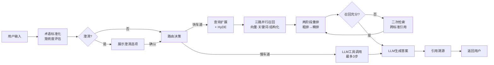

**系统特点**：
- 预处理：术语标准化 → 笼统度评估（0-1分）→ 可选澄清
- 快车道（90%）：适用于单一/明确查询，三路召回 + 重排 + 可选二次检索
- 慢车道（10%）：适用于对比/多跳查询，LLM 决策工具调用（retrieve_standard/clause/list）
- 缓存加速：L1 Embedding(24h) / L2 召回(6h) / L3 重排(4h) / L4 生成(2h)

---

## 一、核心业务流程

### 1.1 用户查询流程（主流程 - 阶段B）

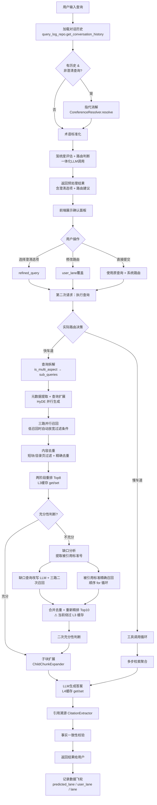

**当前实现关键点**：
1. 多轮对话：`execute_query` 首先加载历史（`MAX_HISTORY_TURNS`），有历史时调用 `CoreferenceResolver` 消解指代
2. 澄清查询（`refined_query` 非空）跳过笼统度评估，仅做术语标准化
3. 路由：关键词规则（`Router`） + 用户覆盖（`user_lane`），`predicted_lane` 来自预处理 LLM 建议
4. 查询拆解：`is_multi_aspect_query` 为真且非对比查询时才拆解，快车道仅拆同主题多方面查询
5. HyDE 生成与 QueryRewriter 扩展通过 `asyncio.gather` 并行执行
6. 过滤放宽优先级：`voltage_level → category → doc_type → standard_no`（召回数 < 3 时逐步丢弃）
7. **已知问题**：retry 路径直接调用 `reranker.rerank()` 未走 L3 缓存，导致重复重排（参见 `24-快车道延迟诊断报告.md`）
8. 数据飞轮记录三个字段：`predicted_lane`（LLM建议）、`user_lane`（用户覆盖）、`lane`（最终执行）

### 1.2 阶段B两次请求流程（序列图）

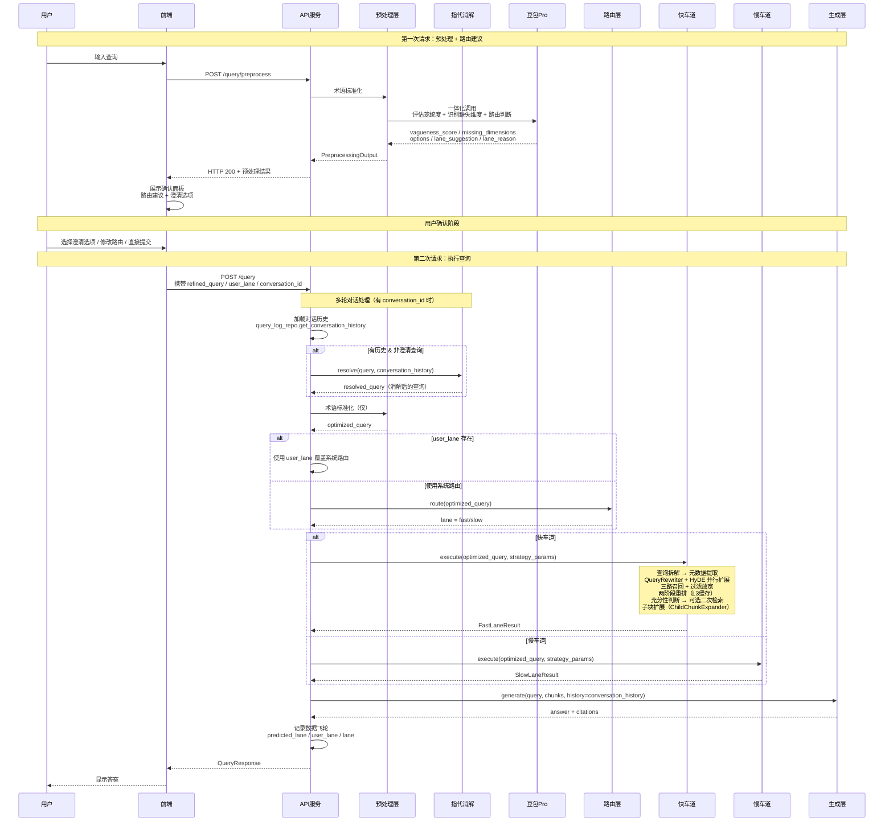

**关键时序**：
1. **第一次请求**：仅预处理，返回路由建议（不执行检索）
2. **多轮对话**：第二次请求携带 `conversation_id`，后端自动加载历史并做指代消解（`CoreferenceResolver`）
3. **用户确认**：前端展示面板，用户可修改路由
4. **第二次请求**：携带用户选择，执行实际检索，对话历史也传入生成层
5. **数据飞轮**：每次查询记录 `predicted_lane`、`user_lane`、`lane` 三字段

### 1.3 快车道详细流程（含缓存层）

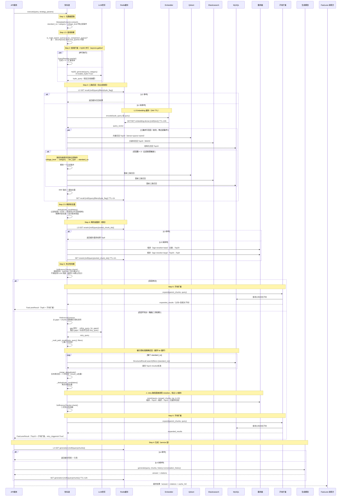

**缓存层说明**：
| 级别 | Key | TTL | 节省操作 |
|------|-----|-----|---------|
| L4 生成缓存 | `generation:{md5(query\|chunks\|conv_id)}` | 12h | 跳过全部检索+生成 |
| L3 重排缓存 | `rerank:{md5(query\|sorted_ids)}` | 1h | 跳过两阶段重排（**仅首轮走缓存**） |
| L2 召回缓存 | `recall:{md5(query\|filters\|hyde_flag)}` | 1h | 跳过三路并行召回 |
| L1 Embedding 缓存 | `embedding:dense:{md5(text)}` | 24h | 跳过向量化推理 |

**已知问题（`24-快车道延迟诊断报告.md`）**：retry 路径在 `fast_lane.py:240` 直接调用 `reranker.rerank()`，未走 L3 缓存，当 retry 召回到完全相同的 chunk 集合时会导致约 42s 的重复计算。

### 1.4 慢车道流程（多跳推理）

#### 流程图

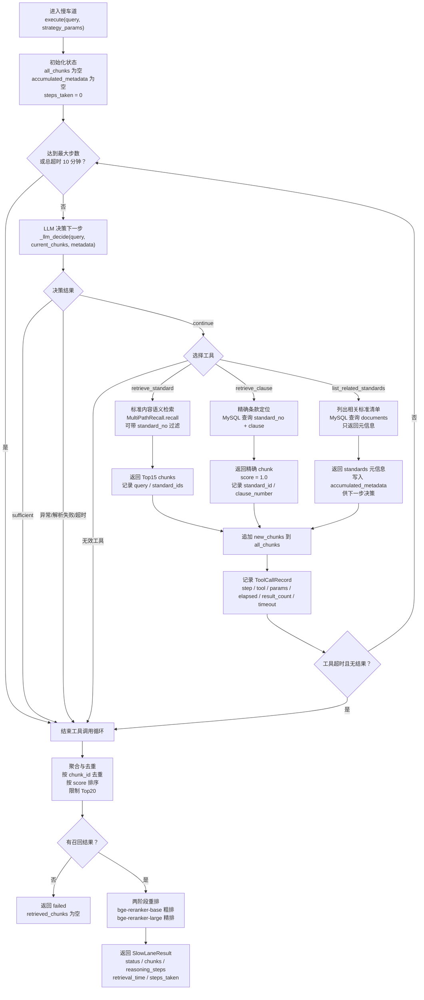

#### 时序图

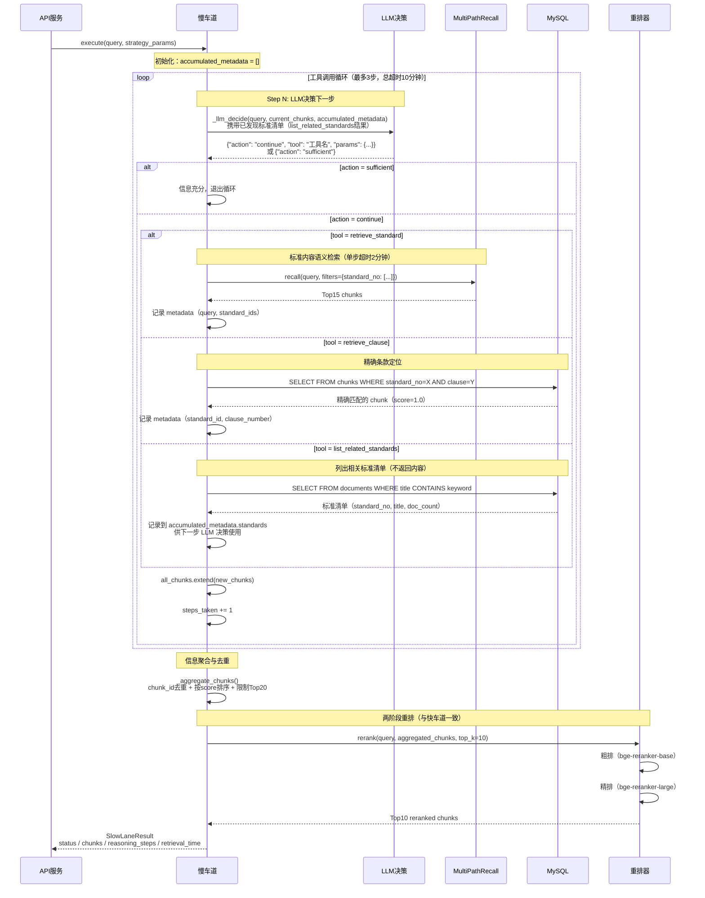

**工具说明**：
- `retrieve_standard`：标准内容语义检索，调用 `MultiPathRecall` 三路召回（可指定 `standard_ids` 过滤），单步返回 Top15
- `retrieve_clause`：精确条款定位，MySQL 精确查询 `standard_no + clause`，返回单条 chunk（score=1.0）
- `list_related_standards`：列出相关标准清单，仅返回元信息（`standard_no`, `title`, `doc_count`），**不返回 chunks**，结果保存到 `accumulated_metadata` 供下一步 LLM 决策使用

**控制约束**：
- 最大步数：3 步
- 单步超时：2 分钟（包含 LLM 决策 30s + 工具调用 120s）
- 总超时：10 分钟
- LLM 决策超时：30 秒（超时默认 `action=sufficient`）

**关键设计**：
1. **metadata 串联**：`list_related_standards` 的标准清单通过 `accumulated_metadata` 传递给下一步 LLM，辅助 `retrieve_standard` 的 `standard_ids` 参数选择
2. **重排一致性**：慢车道最后使用与快车道相同的两阶段重排器（`bge-reranker-base` → `bge-reranker-large`）
3. **充分性判断**：由 LLM 在每步决策中判断（`action: sufficient`），无独立 `SufficiencyChecker`

---

## 二、文档处理流程

### 2.1 文档入库流程（当前实现：CLI脚本）

> **当前实现**：使用 `ingest_markdown.py` + `ingest_batch.py` 直接处理Markdown文件。
> PDF转Markdown使用独立的 `pdf_to_md.py` 脚本，非自动化流水线。

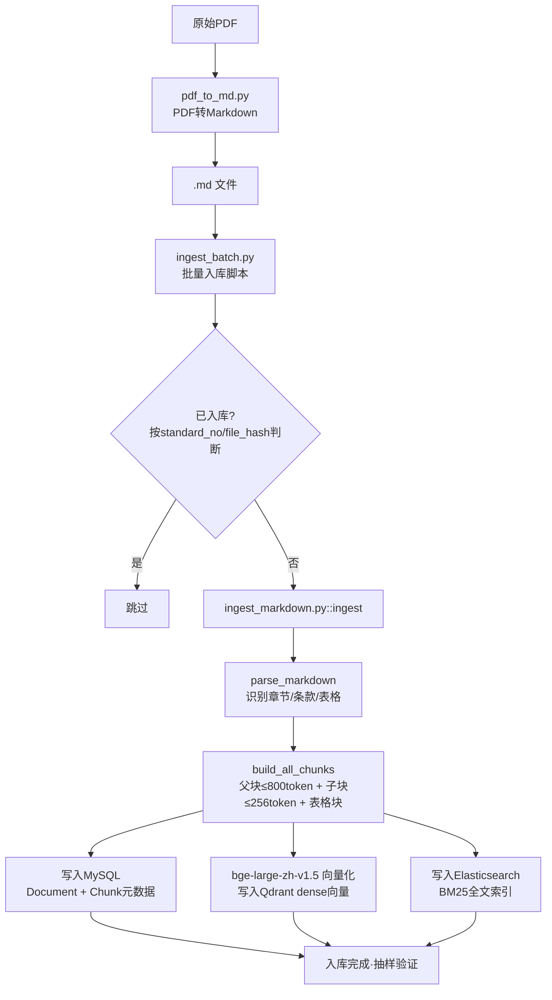

### 2.2 智能分块策略（当前实现）

当前分块逻辑（`ingest_markdown.py::chunk_section`）：

```
.md 文件
    ↓
parse_markdown（结构识别）
    ↓
┌─────────────────────────────────┐
│  ## 标题   →  Section           │
│  ### 小节  →  clause 起始       │
│  x.y.z条款行 → clause           │
│  | 行      →  table buffer      │
└──────────────┬──────────────────┘
               ↓
build_all_chunks（按 token 限制分组）
               ↓
  ┌────────────┬───────────────┐
  │            │               │
父块          子块           表格块
≤800token    ≤256token     独立成块
多条款聚合   单条款内容     含表格标题
  │            │               │
  └────────────┴───────────────┘
               ↓
   挂载元数据（standard_no, chapter, clause）
               ↓
   并行写入 MySQL / Qdrant / Elasticsearch
```

**规划中（未实现）**：PDF版面分析自动化、语义分块、电压等级/专业分类自动提取到元数据字段（`voltage_level` 字段当前恒为NULL）。

---

## 三、提问优化流程

### 3.1 笼统度判断与澄清

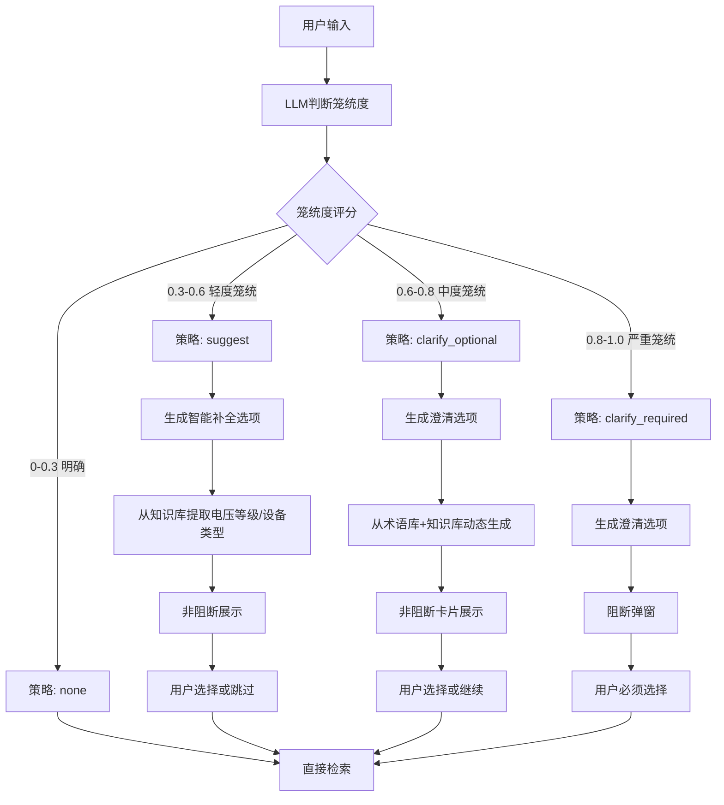

---

## 四、Loop Engineering闭环流程

> ⚠️ **规划中·未实现**：以下流程为系统设计目标，当前尚未开发。

### 4.1 周优化循环（5大闭环）

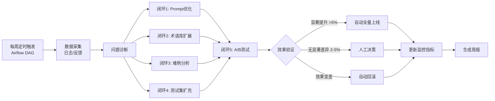

**5大闭环说明**：
| 闭环 | 目标 | 自动化策略 |
|------|------|-----------|
| 闭环1 Prompt优化 | 降低笼统度误判率 | 置信度>0.7自动注入Few-shot |
| 闭环2 术语库扩展 | 挖掘新术语/俗称 | 频次≥5自动加入，≤2自动丢弃 |
| 闭环3 难例分析 | 定位召回失败根因 | 分块/嵌入/重排/缺失分类 |
| 闭环4 测试集扩充 | 防止效果退化 | 用户好评样本自动加入 |
| 闭环5 A/B决策 | 加速迭代 | 显著差异自动全量/下线 |

**数据依赖**：`query_logs`（笼统度、策略、二次检索）、`clarification_logs`（用户选择、自定义输入）、`badcase_tracking`（难例根因）

---

## 五、关键时序图

### 5.1 流式输出时序

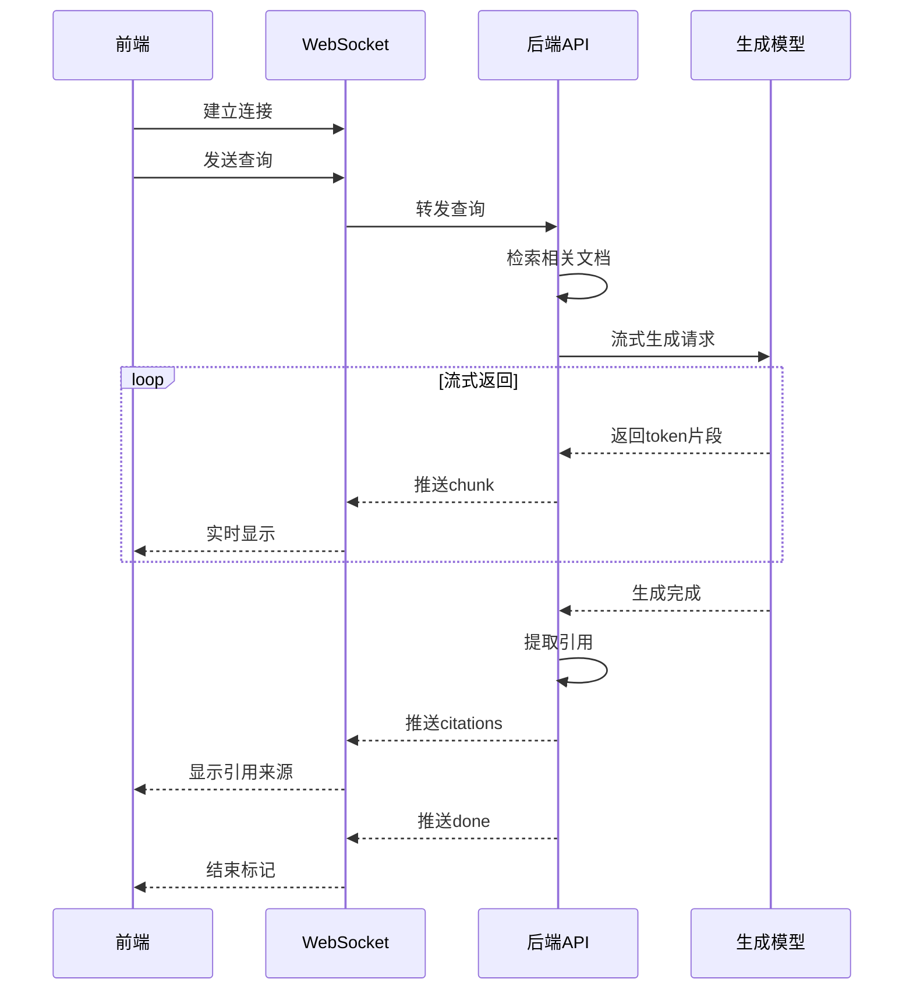

### 5.2 文档上传与处理（规划中·未实现）

> ⚠️ **规划中·未实现**：以下时序图描述目标架构（基于MinIO + Celery + Airflow）。
> 当前实现为CLI脚本直接入库，见 2.1。

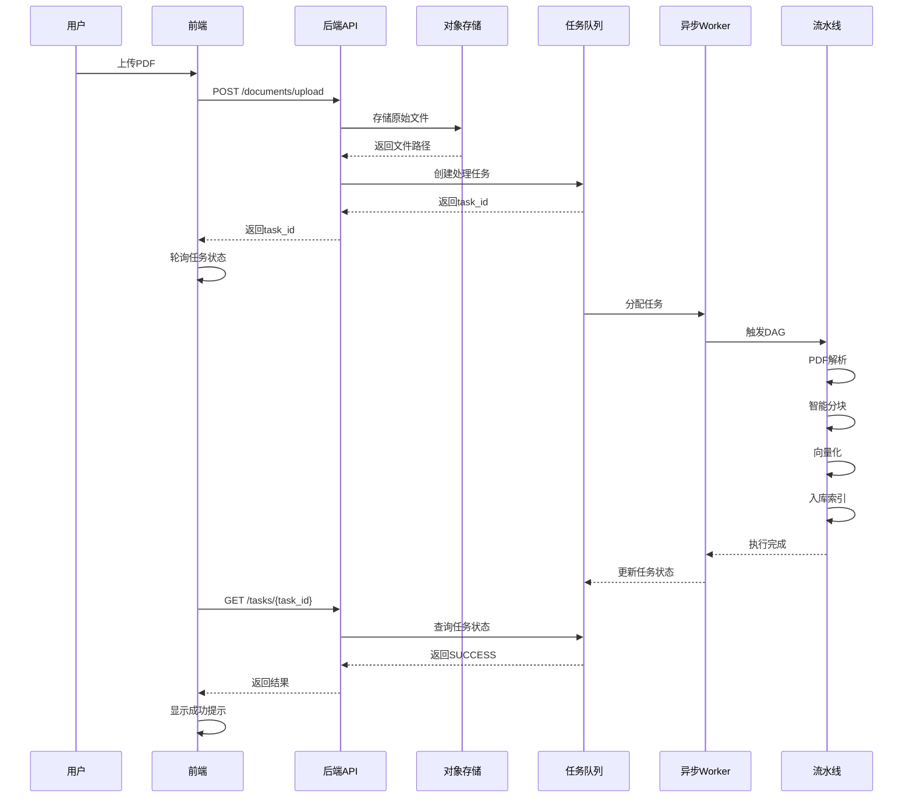

---

## 六、数据流转图

```
┌─────────────┐
│  用户查询    │
└──────┬──────┘
       ↓
┌──────────────────────────────┐
│    多轮对话层（QueryService）  │
│  - 加载对话历史（MySQL）       │
│  - 指代消解（CoreferenceResolver）│
└──────┬───────────────────────┘
       ↓
┌──────────────────────────────┐
│    预处理层（Preprocessor）   │
│  - 术语标准化（TermNormalizer）│
│  - 提问优化（笼统度判断）      │
│  - 路由建议（LLM一体化）       │
└──────┬───────────────────────┘
       ↓ 路由决策（fast / slow）
┌────────────────────────────────────────────┐
│  快车道（FastLane）                          │
│  - 查询拆解（is_multi_aspect，非对比时拆解） │
│  - 元数据提取（standard_no/category过滤）   │
│  - 查询改写/HyDE 并行扩展（asyncio.gather） │
│  - 三路并行召回（向量+关键词+结构化）       │
│    * 低召回时按优先级放宽过滤条件           │
│      voltage_level → category → doc_type → standard_no │
│  - _deduplicate_candidates（精排前去重）    │
│  - 两阶段重排 Top8（首轮，L3缓存 get/set） │
│  - 充分性判断（规则 + LLM兜底，1.5s超时）  │
│  - 可选二次检索（retry）：                  │
│    * gap 改写 LLM + 三路二次召回            │
│    * 被引用标准顺序精确召回（for 循环）     │
│    * 合并去重 + 重新精排 Top10             │
│    * ⚠ retry 重排绕过 L3 缓存             │
│    * 二次充分性判断                         │
│  - 子块扩展（ChildChunkExpander，MySQL）   │
├────────────────────────────────────────────┤
│  慢车道（SlowLane）                          │
│  工具调用循环（最多3步）                     │
└──────┬─────────────────────────────────────┘
       ↓
┌──────────────────────────────┐
│    存储层（三库协同）         │
│  ┌────┐ ┌────┐ ┌──────┐      │
│  │向量│ │全文│ │元数据 │      │
│  │库  │ │检索│ │MySQL  │      │
│  │Qdrant│ │BM25│ │Redis  │    │
│  └────┘ └────┘ └──────┘      │
└──────┬───────────────────────┘
       ↓
┌──────────────────────────────┐
│    生成层（QueryService）      │
│  - L4 生成缓存检查（Redis）    │
│  - LLM生成（AnswerGenerator）  │
│    * 携带对话历史              │
│  - 引用溯源（CitationExtractor）│
│  - 事实校验（规划中）          │
└──────┬───────────────────────┘
       ↓
┌──────────────────────────┐
│    前端展示               │
└──────────────────────────┘
```

---

**相关文档**：
- [01-系统总体架构.md](../01-系统总体架构.md)
- [13-检索引擎层.md](../modules/13-检索引擎层.md)
- [15-阶段B-预处理路由一体化设计.md](../backend/15-阶段B-预处理路由一体化设计.md)
- [08-RAG功能层次与状态机.md](../backend/08-RAG功能层次与状态机.md)

---

## 更新记录

**2026-07-16 - 对齐现有代码实现**：
- 主流程图（1.1）：新增多轮对话/指代消解步骤；查询拆解节点；子块扩展节点；retry 路径增加二次充分性判断；标注 retry 绕过 L3 缓存的已知问题；移除无根据的 90%/10% 路由比例
- Phase B 序列图（1.2）：新增 `CoreferenceResolver` 参与者和对话历史加载步骤；生成层调用增加 `conversation_history` 参数
- 快车道详细流程（1.3）：全面重写以反映实际代码；新增查询拆解、HyDE 并行扩展、过滤放宽逻辑（优先级顺序）、精排前去重、子块扩展；标注 retry 绕过 L3 缓存；L4 缓存移至 service 层；被引用标准召回标注为顺序 for 循环（非并行）
- 数据流转图（六）：新增多轮对话层；快车道细节更新（拆解/HyDE/子块扩展/缓存注意事项）；生成层标注携带对话历史

**2026-07-14 - 跨标准引用检索增强**：
- 更新主流程图（1.1）：召回不充分时增加"缺口分析 → 提取被引用标准号 → 被引用标准精确召回 → 合并重排"流程
- 更新快车道详细流程图（1.3）：在二次检索中加入 `ReferenceExtractor`，从 gaps 和 chunks 中识别 "应符合 GB/T 14549" 类引用
- 更新数据流转图（六）：快车道二次检索新增"跨标准引用提取 + 被引用标准精确召回"

**2026-07-13 - 缓存层更新**：
- 重写快车道详细流程图（1.3）：加入四级 Redis 缓存节点（L1 Embedding / L2 召回 / L3 重排 / L4 生成）
- 新增缓存层说明表（Key 命名、TTL、节省操作）
- 参考文档：[19-缓存层设计.md](../backend/19-缓存层设计.md)

**2026-07-10 - 阶段B更新**：
- 更新主流程图（1.1）：反映"后确认"交互模式，两次请求流程
- 新增阶段B序列图（1.2）：详细展示预处理 → 用户确认 → 执行查询的完整时序

