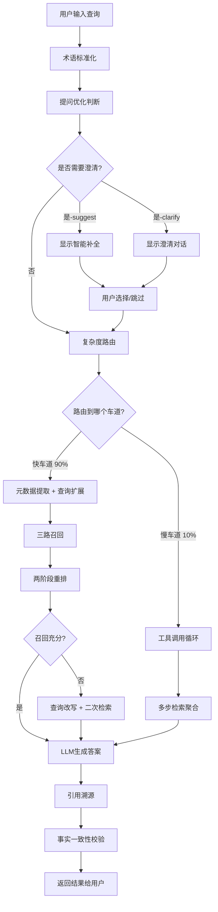
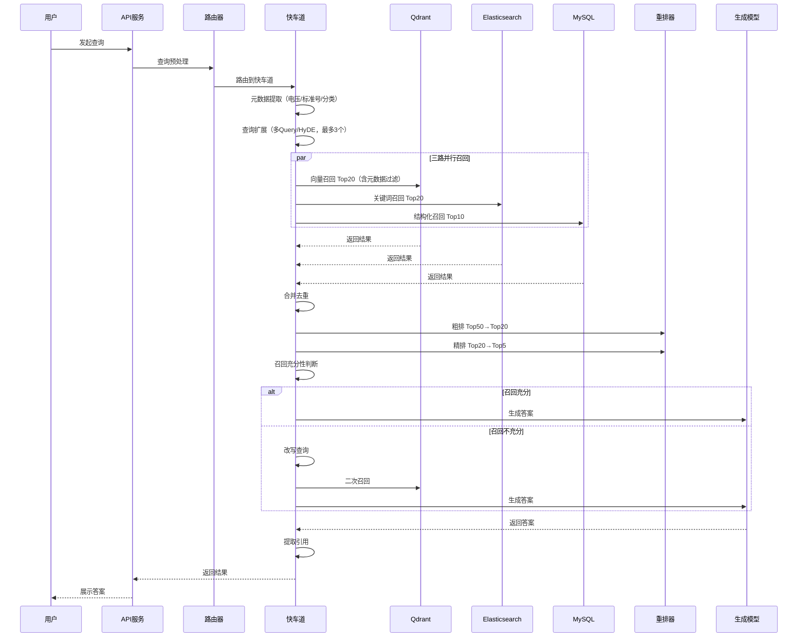
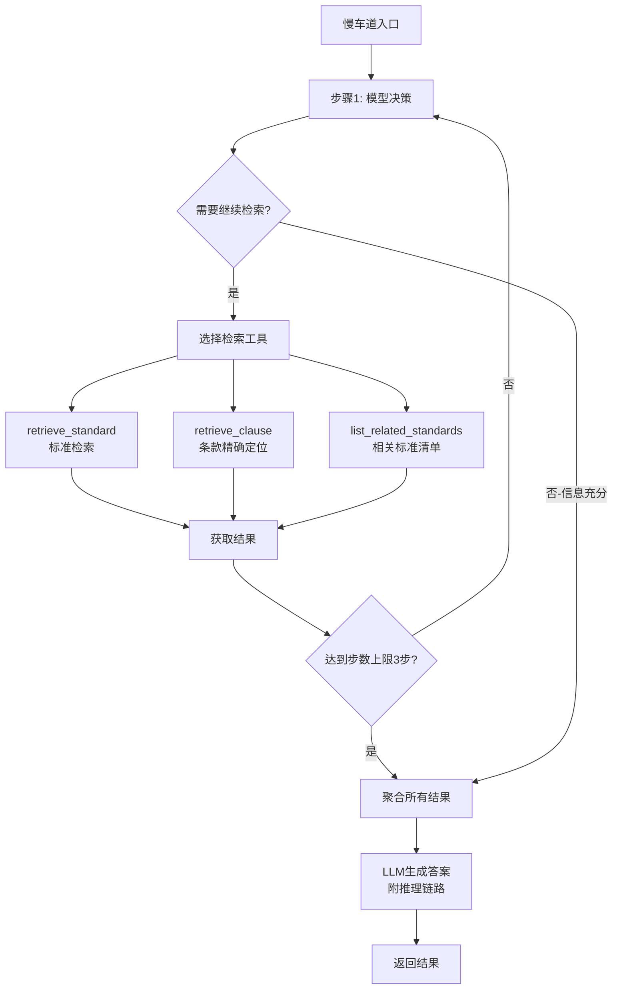
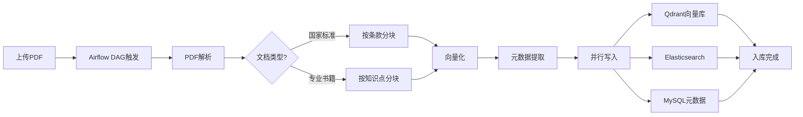
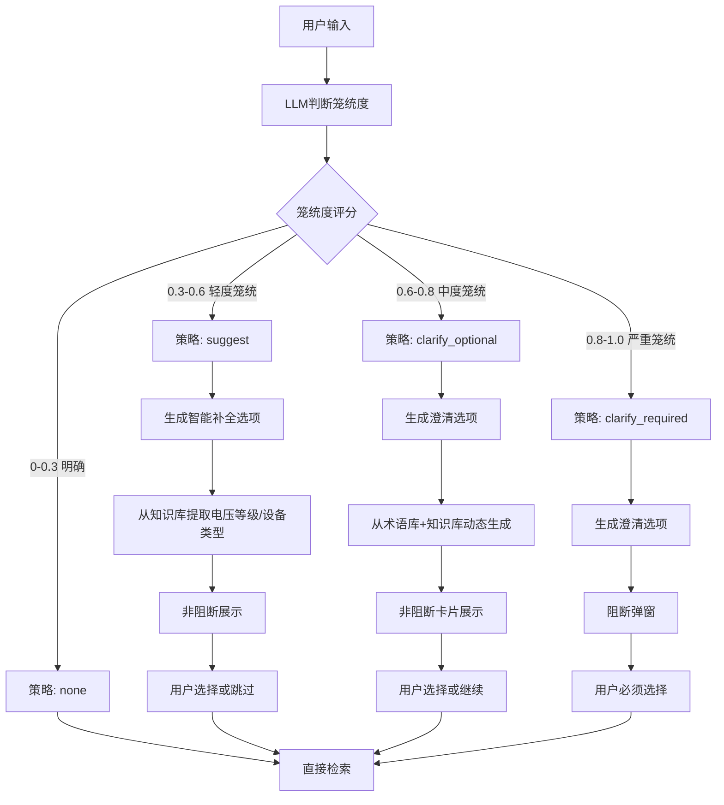
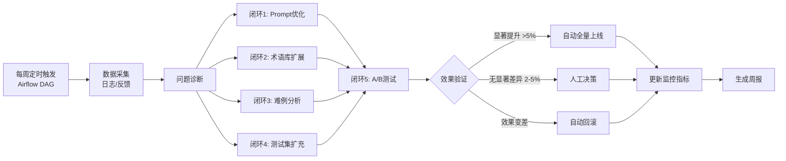
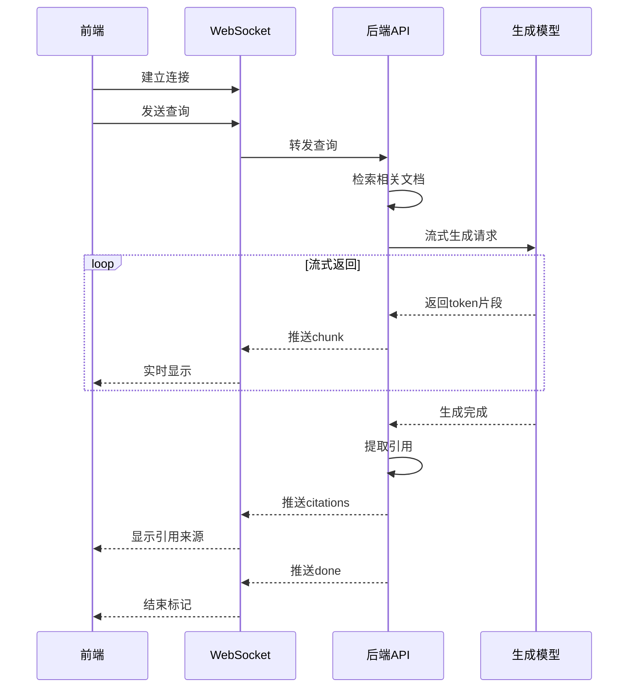
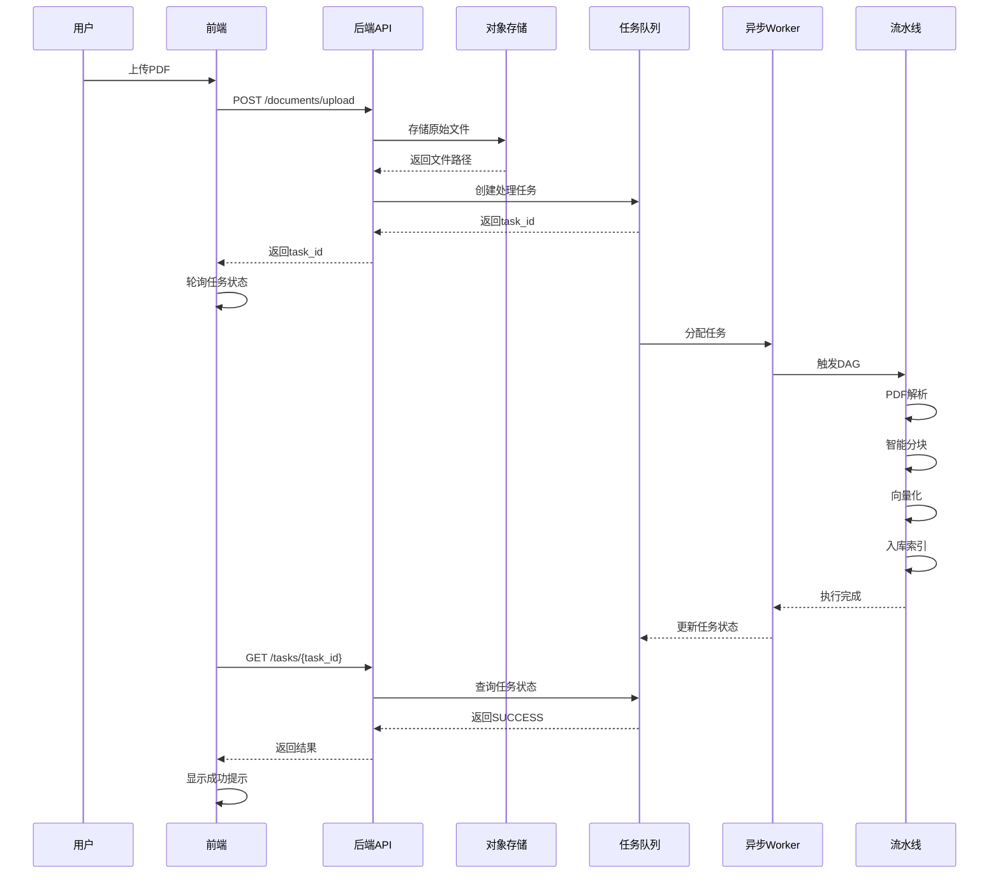

# 业务流程图

## 一、核心业务流程

### 1.1 用户查询流程（主流程）



### 1.2 快车道详细流程



### 1.3 慢车道流程（多跳推理）



**工具说明**：
- `retrieve_standard`：调用快车道三路召回（可指定标准号过滤）
- `retrieve_clause`：精确定位某标准某条款（查MySQL元数据库）
- `list_related_standards`：返回含某关键词的相关标准清单

**控制约束**：步数≤3，单步超时2s，总延迟预算8s，独立限流QPS=10

---

## 二、文档处理流程

### 2.1 文档入库流程



### 2.2 智能分块流程

```
原始文档
    ↓
版面分析（识别标题、正文、表格、公式）
    ↓
结构重建（还原层级关系）
    ↓
┌─────────────┴──────────────┐
│                            │
国家标准                  专业书籍
│                            │
按条款粒度切分            按语义知识点切分
│                            │
生成父块（512-1024 token）   生成父块
│                            │
生成子块（128-256 token）    生成子块
│                            │
└─────────────┬──────────────┘
              ↓
      挂载元数据（标准号、分类、电压等级等）
              ↓
        术语增强（术语标准化）
              ↓
          入库索引
```

---

## 三、提问优化流程

### 3.1 笼统度判断与澄清



---

## 四、Loop Engineering闭环流程

### 4.1 周优化循环（5大闭环）



**5大闭环说明**：
| 闭环 | 目标 | 自动化策略 |
|------|------|-----------|
| 闭环1 Prompt优化 | 降低笼统度误判率 | 置信度>0.7自动注入Few-shot |
| 闭环2 术语库扩展 | 挖掘新术语/俗称 | 频次≥5自动加入，≤2自动丢弃 |
| 闭环3 难例分析 | 定位召回失败根因 | 分块/嵌入/重排/缺失分类 |
| 闭环4 测试集扩充 | 防止效果退化 | 用户好评样本自动加入 |
| 闭环5 A/B决策 | 加速迭代 | 显著差异自动全量/下线 |

**数据依赖**：`query_logs`（笼统度、策略、二次检索）、`clarification_logs`（用户选择、自定义输入）、`badcase_tracking`（难例根因）

---

## 五、关键时序图

### 5.1 流式输出时序



### 5.2 文档上传与处理



---

## 六、数据流转图

```
┌─────────────┐
│  用户查询    │
└──────┬──────┘
       ↓
┌──────────────────────────────┐
│    查询预处理层               │
│  - 术语标准化                 │
│  - 提问优化（笼统度判断）     │
│  - 元数据提取（过滤条件）     │
│  - 查询改写/扩展（HyDE）      │
│  - 复杂度路由                 │
└──────┬───────────────────────┘
       ↓
┌──────────────────────────────┐
│    检索层                     │
│  快车道（查询扩展 + 三路召回  │
│          + 重排 + 充分性判断  │
│          + 二次检索）         │
│  ← → 慢车道（工具调用循环）   │
└──────┬───────────────────────┘
       ↓
┌──────────────────────────────┐
│    存储层（三库协同）         │
│  ┌────┐ ┌────┐ ┌────┐        │
│  │向量│ │全文│ │元数│        │
│  │库  │ │检索│ │据库│        │
│  │稠密│ │BM25│ │MySQL│       │
│  │+稀│ │    │ │Redis│       │
│  │疏  │ │    │ │     │       │
│  └────┘ └────┘ └────┘        │
└──────┬───────────────────────┘
       ↓
┌──────────────────────────────┐
│    生成层                     │
│  - LLM生成（带缓存+降级）     │
│  - 引用溯源                   │
│  - 事实校验                   │
└──────┬───────────────────┘
       ↓
┌──────────────────────────┐
│    前端展示               │
└──────────────────────────┘
```

---

**相关文档**：
- [01-系统总体架构.md](../01-系统总体架构.md)
- [13-检索引擎层.md](../modules/13-检索引擎层.md)
