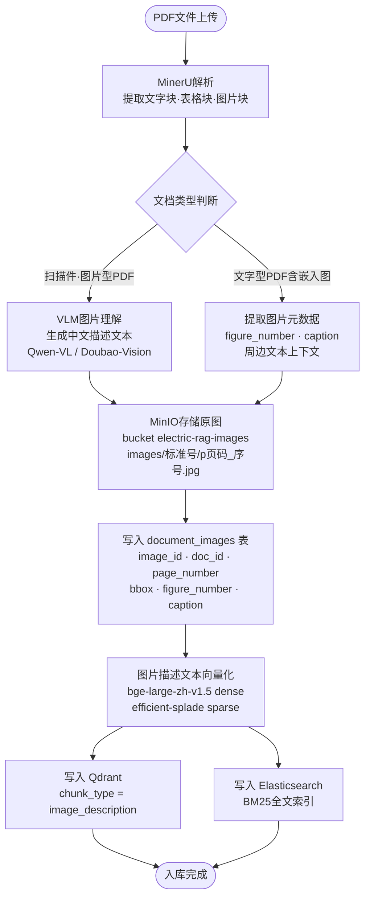
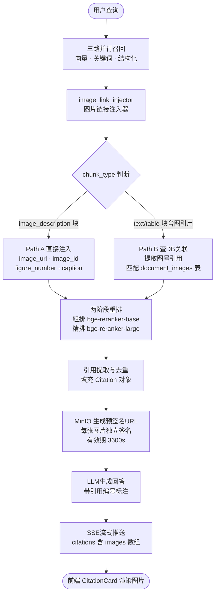

# 图片功能流程图

## 一、图片入库流程

```mermaid
flowchart TD
    A([PDF文件上传]) --> B[MinerU解析<br/>提取文字块·表格块·图片块]
    B --> C{文档类型判断}

    C -->|扫描件·图片型PDF| D[VLM图片理解<br/>生成中文描述文本<br/>Qwen-VL / Doubao-Vision]
    C -->|文字型PDF含嵌入图| E[提取图片元数据<br/>figure_number · caption<br/>周边文本上下文]

    D --> F[MinIO存储原图<br/>bucket electric-rag-images<br/>images/标准号/p页码_序号.jpg]
    E --> F

    F --> G[写入 document_images 表<br/>image_id · doc_id · page_number<br/>bbox · figure_number · caption]

    G --> H[图片描述文本向量化<br/>bge-large-zh-v1.5 dense<br/>efficient-splade sparse]

    H --> I[写入 Qdrant<br/>chunk_type = image_description]
    H --> J[写入 Elasticsearch<br/>BM25全文索引]

    I --> K([入库完成])
    J --> K
```

## 二、图片检索返回流程

```mermaid
flowchart TD
    A([用户查询]) --> B[三路并行召回<br/>向量 · 关键词 · 结构化]

    B --> C[image_link_injector<br/>图片链接注入器]

    C --> D{chunk_type 判断}

    D -->|image_description 块| E[Path A 直接注入<br/>image_url · image_id<br/>figure_number · caption]

    D -->|text/table 块含图引用| F[Path B 查DB关联<br/>提取图号引用<br/>匹配 document_images 表]

    E --> G[两阶段重排<br/>粗排 bge-reranker-base<br/>精排 bge-reranker-large]
    F --> G

    G --> H[引用提取与去重<br/>填充 Citation 对象]

    H --> I[MinIO 生成预签名URL<br/>每张图片独立签名<br/>有效期 3600s]

    I --> J[LLM生成回答<br/>带引用编号标注]

    J --> K[SSE流式推送<br/>citations 含 images 数组]

    K --> L([前端 CitationCard 渲染图片])
```
