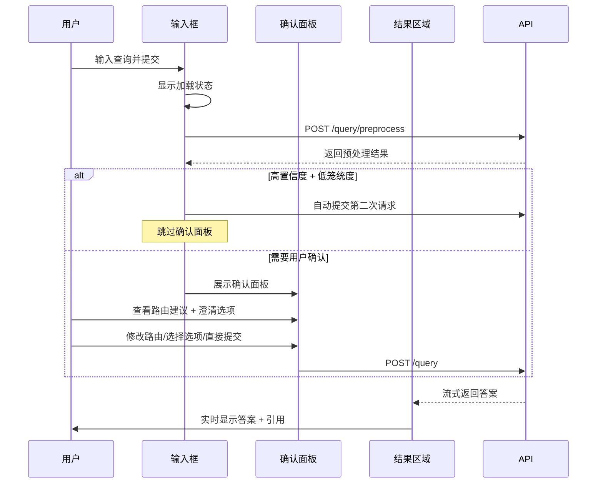

# 阶段B前端交互设计

> 定位：基于"后确认"交互范式的前端页面与组件设计  
> 前置阅读：[15-阶段B-预处理路由一体化设计.md](../backend/15-阶段B-预处理路由一体化设计.md)、[16-业务流程图.md](../flows/16-业务流程图.md)  
> 撰写日期：2026-07-10

---

## 一、核心交互流程

阶段B采用"后确认"交互模式，将预处理结果（笼统度评估 + 路由建议 + 澄清选项）前置展示给用户，用户确认或修改后再执行实际检索。

### 1.1 完整交互流程



### 1.2 两次请求说明

| 请求 | 端点 | 时机 | 返回内容 | HTTP状态 |
|------|------|------|---------|---------|
| 第一次 | `POST /query/preprocess` | 用户提交查询 | 预处理结果（笼统度+路由+选项） | 始终200 |
| 第二次 | `POST /query` | 用户确认后 | 流式答案 + 引用 | 200或错误码 |

**关键变化**：
- 第一次请求始终返回200（不再用400阻断）
- 清晰查询也需要两次请求（但可前端自动跳过确认面板）
- 用户可见并修改路由建议

---

## 二、页面整体布局

### 2.1 查询页面结构

```
┌─────────────────────────────────────────────────┐
│  导航栏                                         │
├─────────────────────────────────────────────────┤
│                                                 │
│  ┌───────────────────────────────────────────┐ │
│  │  查询输入框                               │ │
│  │  [隔离开关安全距离]              [提交]  │ │
│  └───────────────────────────────────────────┘ │
│                                                 │
│  ┌───────────────────────────────────────────┐ │ ← 仅在第一次请求后显示
│  │  确认面板（PreprocessConfirmPanel）      │ │
│  │  ┌─────────────────────────────────────┐ │ │
│  │  │ 路由建议                            │ │ │
│  │  │ 快车道 ⚡ [切换为慢车道]             │ │ │
│  │  │ 理由: 单一维度查询，无需多跳推理   │ │ │
│  │  └─────────────────────────────────────┘ │ │
│  │  ┌─────────────────────────────────────┐ │ │
│  │  │ 补充信息（可选）                     │ │ │
│  │  │ ○ 10kV配电装置（GB 50053，23篇）   │ │ │
│  │  │ ○ 35kV配电装置（DL/T 5352，18篇）  │ │ │
│  │  │ ● 跳过，使用原始查询                │ │ │
│  │  └─────────────────────────────────────┘ │ │
│  │                         [提交查询]        │ │
│  └───────────────────────────────────────────┘ │
│                                                 │
│  ┌───────────────────────────────────────────┐ │ ← 第二次请求后显示
│  │  答案展示区域（AnswerDisplay）           │ │
│  │  流式答案文本...                          │ │
│  │                                           │ │
│  │  引用来源：                               │ │
│  │  [1] GB 50053-2013 第3.2.1条             │ │
│  │  [2] DL/T 5352-2018 第4.1.3条            │ │
│  └───────────────────────────────────────────┘ │
│                                                 │
└─────────────────────────────────────────────────┘
```

### 2.2 状态机

前端维护以下状态：

```typescript
type QueryState = 
  | 'idle'           // 初始状态
  | 'preprocessing'  // 第一次请求中
  | 'confirming'     // 展示确认面板，等待用户操作
  | 'querying'       // 第二次请求中（流式输出）
  | 'completed'      // 查询完成
  | 'error';         // 出错

interface QueryContext {
  state: QueryState;
  originalQuery: string;
  preprocessResult: PreprocessResponse | null;
  userSelections: {
    selectedOptionId: number | null;
    userLane: 'fast' | 'slow' | null;
  };
  finalAnswer: string;
  citations: Citation[];
}
```

状态转换：

```
idle → preprocessing → confirming → querying → completed
  ↓         ↓            ↓            ↓
  └─────────┴────────────┴────────────→ error
```

---

## 三、核心组件设计

### 3.1 查询输入框（QueryInput）

**功能**：
- 用户输入查询文本
- 提交按钮触发第一次请求
- 展示加载状态
- 展示严重笼统警示

**状态**：
```typescript
interface QueryInputState {
  query: string;
  isLoading: boolean;
  vaguenessWarning: string | null; // 笼统度 > 0.8 时显示警示
}
```

**UI规范**：
- 输入框：最小高度60px，支持多行输入，最多显示3行后滚动
- 提交按钮：loading状态时禁用并显示spinner
- 警示文字：黄色背景，显示在输入框下方

**示例布局**：
```
┌────────────────────────────────────────────┐
│ 输入您的问题...                            │
│                                            │
└────────────────────────────────────────────┘
  [提交查询]
  
  ⚠ 查询较笼统，可能影响回答质量。建议补充：电压等级、设备类型
```

---

### 3.2 预处理确认面板（PreprocessConfirmPanel）

**功能**：
- 展示路由建议（快车道/慢车道）及置信度
- 提供路由切换按钮
- 展示澄清选项列表
- 提交按钮触发第二次请求

**组件结构**：
```
PreprocessConfirmPanel
  ├─ RouteRecommendation （路由建议卡片）
  ├─ ClarificationOptions （澄清选项列表）
  └─ ConfirmButton （提交按钮）
```

**Props**：
```typescript
interface PreprocessConfirmPanelProps {
  preprocessResult: PreprocessResponse;
  onConfirm: (selection: UserSelection) => void;
  onCancel: () => void;
}

interface UserSelection {
  selectedOptionId: number | null;
  refinedQuery: string | null;
  userLane: 'fast' | 'slow' | null;
}
```

**自动跳过逻辑**（在父组件实现）：
```typescript
// 高置信度 + 低笼统度时自动跳过确认面板
function shouldAutoSubmit(result: PreprocessResponse): boolean {
  return result.lane_suggestion.confidence > 0.85 
      && result.vagueness_score < 0.3;
}
```

---

### 3.3 路由建议卡片（RouteRecommendation）

**功能**：
- 展示推荐的车道（快车道/慢车道）
- 展示置信度（进度条 + 百分比）
- 展示路由理由
- 提供切换按钮

**Props**：
```typescript
interface RouteRecommendationProps {
  lane: 'fast' | 'slow';
  confidence: number;
  reason: string;
  userLane: 'fast' | 'slow' | null;
  onToggle: () => void;
}
```

**UI规范**：
- 快车道：蓝色图标 ⚡，"预计2-3秒"
- 慢车道：橙色图标 🔄，"预计5-8秒，多步推理"
- 置信度：
  - ≥0.8：绿色进度条
  - 0.6-0.8：黄色进度条 + "建议核对"提示
  - <0.6：红色进度条 + "不确定，请选择"提示
- 切换按钮：用户点击后 `userLane` 更新，卡片展示用户选择状态

**示例布局（快车道）**：
```
┌──────────────────────────────────────────┐
│ 推荐路由                                 │
│ ⚡ 快车道（预计2-3秒）   [切换为慢车道]  │
│                                          │
│ 置信度：85%  ████████████░░░░           │
│                                          │
│ 理由：单一维度查询，包含具体设备类型，   │
│       无对比或多跳需求                   │
└──────────────────────────────────────────┘
```

**示例布局（用户切换后）**：
```
┌──────────────────────────────────────────┐
│ 推荐路由                                 │
│ 🔄 慢车道（预计5-8秒）   [切换为快车道]  │
│ 📝 您已选择慢车道（系统建议：快车道）    │
│                                          │
│ 置信度：85%  ████████████░░░░           │
└──────────────────────────────────────────┘
```

---

### 3.4 澄清选项列表（ClarificationOptions）

**功能**：
- 展示澄清选项（多选一 + "跳过"选项）
- 标记KB验证状态（kb_verified=true显示文档数量）
- 选中后更新 `refinedQuery`

**Props**：
```typescript
interface ClarificationOptionsProps {
  options: OptimizationOption[];
  strategy: 'none' | 'suggest' | 'clarify_optional' | 'clarify_required';
  selectedId: number | null;
  onSelect: (optionId: number | null, refinedQuery: string | null) => void;
}

interface OptimizationOption {
  id: number;
  label: string;
  refined_query: string;
  standard_preview: string | null;
  doc_count: number | null;
  kb_verified: boolean;
}
```

**UI规范**：
- strategy='none'：不显示该组件
- strategy='suggest'：标题"补充信息（可选）"，默认选中"跳过"
- strategy='clarify_optional'：标题"建议补充（可选）"，默认选中"跳过"
- strategy='clarify_required'：标题"请选择具体场景"，无默认选中

**选项样式**：
- kb_verified=true：显示标准号预览 + 文档数量，绿色对勾图标 ✓
- kb_verified=false：灰色文字"仅供参考"，虚线边框

**示例布局**：
```
┌──────────────────────────────────────────┐
│ 补充信息（可选）                         │
│                                          │
│ ○ 10kV配电装置                           │
│   10kV配电装置与建筑物及各类设备的安全   │
│   净距要求                               │
│   ✓ 基于知识库：GB 50053-2013，23篇文档 │
│                                          │
│ ○ 35kV配电装置                           │
│   35kV配电装置与建筑物及各类设备的安全   │
│   净距要求                               │
│   ⓘ 仅供参考（未在知识库验证）           │
│                                          │
│ ● 跳过，使用原始查询                     │
└──────────────────────────────────────────┘
```

---

### 3.5 答案展示区域（AnswerDisplay）

**功能**：
- 流式展示LLM生成的答案
- 展示引用来源列表
- 支持引用点击跳转到源文档

**Props**：
```typescript
interface AnswerDisplayProps {
  answer: string;
  isStreaming: boolean;
  citations: Citation[];
  onCitationClick: (citation: Citation) => void;
}

interface Citation {
  id: number;
  standard_no: string;
  title: string;
  chapter: string;
  clause: string | null;
  content_preview: string;
  chunk_id: string;
}
```

**UI规范**：
- 答案文本：markdown渲染，支持代码块、表格、列表
- 流式输出：每收到新token追加到末尾，带打字机效果
- 引用标记：文本中的 `[1]` `[2]` 为蓝色可点击链接
- 引用列表：展示在答案下方，卡片式布局

**示例布局**：
```
┌────────────────────────────────────────────┐
│ 根据GB 50053-2013第3.2.1条[1]的规定，     │
│ 10kV户内配电装置与建筑物的安全净距应      │
│ 不小于以下数值...                         │
│                                            │
│ 引用来源：                                 │
│ ┌────────────────────────────────────────┐│
│ │[1] GB 50053-2013                       ││
│ │    20kV及以下变电所设计规范            ││
│ │    第3章 配电装置 > 第3.2.1条          ││
│ │    "户内配电装置各种通道最小宽度..."   ││
│ │                           [查看详情 →] ││
│ └────────────────────────────────────────┘│
│ ┌────────────────────────────────────────┐│
│ │[2] DL/T 5352-2018                      ││
│ │    高压配电装置设计规范                ││
│ │    第4章 布置 > 第4.1.3条              ││
│ │                           [查看详情 →] ││
│ └────────────────────────────────────────┘│
└────────────────────────────────────────────┘
```

---

## 四、API对接

### 4.1 第一次请求（预处理）

**端点**：`POST /api/v1/query/preprocess`

**请求体**：
```typescript
interface PreprocessRequest {
  query: string;
}
```

**响应体**：
```typescript
interface PreprocessResponse {
  normalized_query: string;
  vagueness_score: number;
  strategy: 'none' | 'suggest' | 'clarify_optional' | 'clarify_required';
  missing_dimensions: string[];
  options: OptimizationOption[];
  lane_suggestion: {
    lane: 'fast' | 'slow';
    confidence: number;
    reason: string;
  };
}
```

**前端处理逻辑**：
```typescript
async function handleQuerySubmit(query: string) {
  setState('preprocessing');
  
  try {
    const result = await api.post('/query/preprocess', { query });
    
    // 判断是否自动跳过确认面板
    if (shouldAutoSubmit(result)) {
      // 直接提交第二次请求
      await executeQuery(query, null, null);
    } else {
      // 展示确认面板
      setPreprocessResult(result);
      setState('confirming');
      
      // 严重笼统时显示警示
      if (result.vagueness_score > 0.8) {
        setVaguenessWarning(
          `查询较笼统，可能影响回答质量。建议补充：${
            result.missing_dimensions.map(d => DIMENSION_LABELS[d]).join('、')
          }`
        );
      }
    }
  } catch (error) {
    setState('error');
    showError(error);
  }
}
```

---

### 4.2 第二次请求（执行查询）

**端点**：`POST /api/v1/query`

**请求体**：
```typescript
interface QueryRequest {
  query: string;                    // 原始查询
  refined_query?: string | null;    // 用户选择的澄清选项
  selected_option_id?: number | null;
  user_lane?: 'fast' | 'slow' | null;
  clarification_context?: {         // 完整预处理结果，用于日志记录
    vagueness_score: number;
    strategy: string;
    missing_dimensions: string[];
    options: OptimizationOption[];
  };
}
```

**响应**：流式SSE（Server-Sent Events）

```
event: chunk
data: {"delta": "根据"}

event: chunk
data: {"delta": "GB 50053"}

event: citation
data: {"id": 1, "standard_no": "GB 50053-2013", ...}

event: done
data: {}
```

**前端处理逻辑**：

> 注意：原生 `EventSource` 仅支持 GET，POST 流式接口需改用 `fetch` + `ReadableStream`。`abortController` 为模块级变量，与预处理请求共用同一个实例（提交新查询时统一 abort）：

```typescript
async function executeQuery(
  query: string,
  refinedQuery: string | null,
  userLane: 'fast' | 'slow' | null
) {
  setState('querying');
  setAnswer('');
  setCitations([]);

  const resp = await fetch('/api/v1/query', {
    method: 'POST',
    headers: { 'Content-Type': 'application/json' },
    body: JSON.stringify({
      query,
      refined_query: refinedQuery,
      user_lane: userLane,
      clarification_context: preprocessResult
    }),
    signal: abortController.signal
  });

  if (!resp.ok) {
    setState('error');
    showError(await resp.text());
    return;
  }

  const reader = resp.body!.getReader();
  const decoder = new TextDecoder();

  while (true) {
    const { done, value } = await reader.read();
    if (done) break;

    // 解析 SSE 格式: "event: xxx\ndata: {...}\n\n"
    const text = decoder.decode(value, { stream: true });
    for (const line of text.split('\n')) {
      if (line.startsWith('data: ')) {
        const payload = JSON.parse(line.slice(6));
        if (payload.delta !== undefined) {
          setAnswer(prev => prev + payload.delta);
        } else if (payload.citation) {
          setCitations(prev => [...prev, payload.citation]);
        } else if (payload.done) {
          setState('completed');
        }
      }
    }
  }
}
```

---

## 五、交互细节规范

### 5.1 加载状态

| 状态 | 展示位置 | 样式 |
|------|---------|------|
| preprocessing | 输入框提交按钮 | spinner + "分析中..." |
| confirming | 确认面板提交按钮 | 正常启用 |
| querying | 答案区域 | 打字机效果 + "生成中..." |

---

### 5.2 错误处理

**第一次请求失败**：
- 在输入框下方展示错误提示（红色背景）
- 保持输入框可编辑，允许重试
- 错误文案示例："预处理失败，请稍后重试"

**第二次请求失败**：
- 在答案区域展示错误卡片
- 提供"重新提交"按钮，复用当前选择
- 错误文案示例："查询失败：{具体原因}"

**超时处理**：
- 第一次请求超时（>10s）：自动重试1次
- 第二次请求超时（>15s）：提示用户尝试切换车道

---

### 5.3 用户行为反馈

**路由切换**：
- 点击切换按钮，卡片立即更新
- 显示"您已选择XX车道（系统建议：YY车道）"
- 记录到 `user_lane` 字段，提交时发送给后端

**选择澄清选项**：
- 单选，选中后其他选项变灰
- "跳过"选项：`selected_option_id=null`，`refined_query=null`
- 其他选项：`selected_option_id=X`，`refined_query=选项的refined_query`

**直接提交**（跳过澄清）：
- 用户可在确认面板直接点击"提交查询"
- 等同于选择"跳过"选项

---

### 5.4 响应式布局

**桌面端（>768px）**：
- 确认面板：最大宽度800px，居中展示
- 路由建议和澄清选项：左右布局（4:6比例）

**移动端（≤768px）**：
- 确认面板：全宽，纵向堆叠
- 路由建议在上，澄清选项在下

---

## 六、数据流

### 6.1 完整数据流

```
用户输入
  ↓
[State: idle → preprocessing]
  ↓
POST /query/preprocess
  ↓
PreprocessResponse
  ↓
[判断] shouldAutoSubmit?
  ├─ Yes → 直接 POST /query
  └─ No → [State: preprocessing → confirming]
           展示 PreprocessConfirmPanel
           用户交互（修改路由/选择选项）
             ↓
           点击提交
             ↓
           [State: confirming → querying]
             ↓
           POST /query (携带 user_lane / refined_query)
             ↓
           SSE流式输出
             ├─ chunk → 追加到 answer
             ├─ citation → 追加到 citations
             └─ done → [State: querying → completed]
```

### 6.2 状态管理（推荐方案）

**使用Vue 3 Composition API**：
```typescript
// composables/useQuery.ts
export function useQuery() {
  const state = ref<QueryState>('idle');
  const originalQuery = ref('');
  const preprocessResult = ref<PreprocessResponse | null>(null);
  const userLane = ref<'fast' | 'slow' | null>(null);
  const selectedOptionId = ref<number | null>(null);
  const refinedQuery = ref<string | null>(null);
  const answer = ref('');
  const citations = ref<Citation[]>([]);
  
  async function submitQuery(query: string) {
    originalQuery.value = query;
    state.value = 'preprocessing';
    // ... 第一次请求逻辑
  }
  
  async function confirmAndExecute() {
    state.value = 'querying';
    // ... 第二次请求逻辑
  }
  
  function toggleLane() {
    const suggested = preprocessResult.value?.lane_suggestion.lane;
    // 第一次点击：切换到与系统建议相反的车道
    // 再次点击：恢复为 null（接受系统建议），按钮文案随之切换
    userLane.value = userLane.value === null 
      ? (suggested === 'fast' ? 'slow' : 'fast')
      : null;
  }
  
  return {
    state,
    preprocessResult,
    userLane,
    selectedOptionId,
    refinedQuery,
    answer,
    citations,
    submitQuery,
    confirmAndExecute,
    toggleLane
  };
}
```

**使用React Hooks**：
```typescript
// hooks/useQuery.ts
export function useQuery() {
  const [state, setState] = useState<QueryState>('idle');
  const [preprocessResult, setPreprocessResult] = 
    useState<PreprocessResponse | null>(null);
  const [userLane, setUserLane] = 
    useState<'fast' | 'slow' | null>(null);
  // ... 其他状态
  
  const submitQuery = useCallback(async (query: string) => {
    // ... 实现
  }, []);
  
  const toggleLane = useCallback(() => {
    // ... 实现
  }, [preprocessResult]);
  
  return {
    state,
    preprocessResult,
    userLane,
    submitQuery,
    toggleLane,
    // ...
  };
}
```

---

## 七、样式规范

### 7.1 色彩方案

| 元素 | 颜色 | 说明 |
|------|------|------|
| 快车道图标/文字 | `#1890ff` (蓝色) | 主色调，代表高效 |
| 慢车道图标/文字 | `#fa8c16` (橙色) | 警示色，代表深度推理 |
| 置信度进度条（高） | `#52c41a` (绿色) | >=0.8 |
| 置信度进度条（中） | `#faad14` (黄色) | 0.6-0.8 |
| 置信度进度条（低） | `#ff4d4f` (红色) | <0.6 |
| KB验证标记 | `#52c41a` (绿色) | kb_verified=true |
| 未验证标记 | `#8c8c8c` (灰色) | kb_verified=false |
| 严重笼统警示 | `#fff7e6` 背景 + `#fa8c16` 文字 | vagueness_score>0.8 |
| 用户修改提示 | `#e6f7ff` 背景 + `#1890ff` 文字 | user_lane覆盖 |

---

### 7.2 间距与尺寸

| 元素 | 规范 |
|------|------|
| 输入框高度 | 60px（最小），最多3行 |
| 确认面板宽度 | 桌面端最大800px，移动端100% |
| 确认面板内边距 | 24px |
| 路由建议卡片 | 内边距16px，圆角8px |
| 澄清选项卡片 | 内边距12px，圆角4px，间距8px |
| 引用卡片 | 内边距16px，圆角8px，间距12px |
| 按钮高度 | 40px（大按钮），32px（次要按钮） |

---

### 7.3 字体规范

| 元素 | 字号 | 字重 |
|------|------|------|
| 标题 | 18px | 600 (semibold) |
| 正文 | 14px | 400 (regular) |
| 辅助文字 | 12px | 400 (regular) |
| 按钮文字 | 14px | 500 (medium) |
| 路由理由 | 13px | 400 (regular) |
| 引用来源标准号 | 14px | 600 (semibold) |
| 引用预览文本 | 12px | 400 (regular) |

---

## 八、无障碍设计

### 8.1 键盘导航

| 操作 | 快捷键 | 行为 |
|------|--------|------|
| 提交查询 | `Enter`（输入框内） | 触发第一次请求 |
| 提交查询 | `Ctrl+Enter`（输入框内） | 强制多行输入后提交 |
| 确认提交 | `Enter`（确认面板） | 触发第二次请求 |
| 取消 | `Esc` | 关闭确认面板，返回idle状态 |
| 选项导航 | `Tab` / `Shift+Tab` | 在澄清选项间切换焦点 |
| 选择选项 | `Space` | 选中当前焦点选项 |

---

### 8.2 屏幕阅读器支持

焦点顺序：
1. 查询输入框（aria-label="输入查询问题"）
2. 提交按钮
3. 确认面板（role="dialog", aria-labelledby="confirm-title"）：
   - 路由切换按钮（aria-pressed 反映当前切换状态）
   - 澄清选项 fieldset（radio group，legend="补充信息"）
   - 提交查询按钮
4. 答案区域（role="article", aria-live="polite"，流式输出时实时通知屏幕阅读器）
5. 引用卡片（可点击，带 aria-label="查看引用详情"）

**焦点陷阱**：
- 确认面板展开时，焦点限制在面板内
- `Esc` 关闭面板时，焦点返回输入框

---

## 九、性能优化

### 9.1 请求取消

用户重复提交时取消前一个未完成的预处理请求，避免竞态：

```typescript
let abortController: AbortController | null = null;

async function submitQuery(query: string) {
  if (abortController) abortController.abort();
  abortController = new AbortController();

  try {
    const result = await fetch('/query/preprocess', {
      signal: abortController.signal,
      method: 'POST',
      body: JSON.stringify({ query })
    });
  } catch (error) {
    if (error.name === 'AbortError') return;
    throw error;
  }
}
```

### 9.2 预处理结果缓存

同一查询文本在会话内只调用一次预处理 API：

```typescript
const preprocessCache = new Map<string, PreprocessResponse>();

async function submitQuery(query: string) {
  const key = query.trim().toLowerCase();
  if (preprocessCache.has(key)) {
    setPreprocessResult(preprocessCache.get(key)!);
    setState('confirming');
    return;
  }
  const result = await api.post('/query/preprocess', { query });
  preprocessCache.set(key, result);
}
```

### 9.3 流式渲染防抖

每50ms批量合并 SSE chunk，减少 re-render 次数（在 fetch ReadableStream 的读取循环中应用）：

```typescript
let buffer = '';
let timer: ReturnType<typeof setTimeout> | null = null;

function handleDelta(delta: string) {
  buffer += delta;
  if (!timer) {
    timer = setTimeout(() => {
      setAnswer(prev => prev + buffer);
      buffer = '';
      timer = null;
    }, 50);
  }
}
```

---

## 十、测试要点

| 测试类型 | 覆盖场景 |
|---------|---------|
| 单元测试 | RouteRecommendation 切换逻辑；ClarificationOptions 选中/跳过；shouldAutoSubmit 边界值 |
| 集成测试 | 高置信度自动跳过确认面板；user_lane 修改后正确传递；refined_query 正确携带 |
| E2E测试 | 完整查询流程（输入→确认→流式答案→引用）；错误重试流程 |
| 无障碍测试 | 键盘全程可操作；屏幕阅读器播报确认面板内容 |

---

## 十一、实施计划

### 阶段1：基础组件开发（3天）
- [ ] QueryInput 输入框组件
- [ ] RouteRecommendation 路由建议卡片
- [ ] ClarificationOptions 澄清选项列表
- [ ] AnswerDisplay 答案展示组件

### 阶段2：API对接（2天）
- [ ] 第一次请求（预处理），处理 shouldAutoSubmit 分支
- [ ] 第二次请求（SSE流式查询），携带 user_lane / refined_query
- [ ] 错误处理与超时重试

### 阶段3：状态管理与交互（2天）
- [ ] useQuery composable / hook
- [ ] 路由切换逻辑
- [ ] 焦点陷阱与 Esc 关闭

### 阶段4：样式与响应式（2天）
- [ ] 桌面端布局（路由建议与澄清选项左右4:6）
- [ ] 移动端适配（纵向堆叠）
- [ ] 无障碍优化

### 阶段5：测试与优化（2天）
- [ ] 单元测试 + 集成测试
- [ ] E2E测试（Playwright）
- [ ] 请求取消与预处理缓存

---

## 十二、与后端文档的对应关系

| 前端模块 | 后端文档 | 对应关系 |
|---------|---------|---------|
| PreprocessConfirmPanel | [15-阶段B设计](../backend/15-阶段B-预处理路由一体化设计.md) | 展示预处理结果 |
| RouteRecommendation | 同上，第三节 | 展示 lane_suggestion |
| ClarificationOptions | 同上，第三节"missing_dimensions改为枚举" | 展示 options + kb_verified |
| API /query/preprocess | 同上，第五节 | 第一次请求对接 |
| API /query | 同上，第五节 | 第二次请求，携带 user_lane |
| 数据飞轮 | 同上，第六节 | 前端提交 user_lane 供后端记录三字段 |
| 业务流程图 | [16-业务流程图.md](../flows/16-业务流程图.md) | 前端实现对应 1.2 序列图 |

---

## 更新记录

**2026-07-10 - 初版**：
- 基于阶段B"后确认"交互模式创建前端设计文档
- 定义核心组件结构（QueryInput / RouteRecommendation / ClarificationOptions / AnswerDisplay）
- 明确两次请求流程和状态机
- 规范样式、无障碍、性能优化和测试要点
