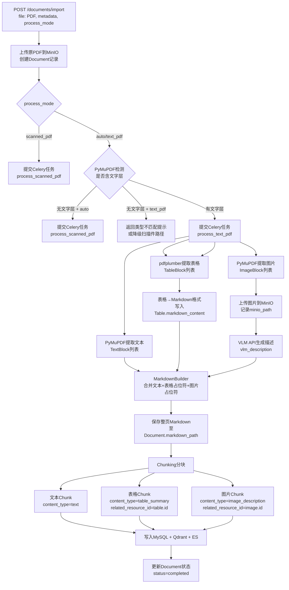

# 28-文字PDF-VLM导入设计

## 1. 背景与目标

### 1.1 问题背景

系统已有扫描件PDF处理路径（`14.1-扫描件PDF存储方案.md`），该路径将每页PDF转为整页图片后由VLM进行OCR识别。然而，大量电力国标PDF为**文字版PDF**（native text PDF）——文本层可直接提取，图片和表格以嵌入对象形式存在。对这类文档继续走扫描件路径会造成信息损失（文本精度下降、表格结构破坏）且成本高昂。

### 1.2 设计目标

- 对文字版PDF：**直接提取文本**，保留原始语义精度，不再整页转图送VLM OCR
- **表格**：用pdfplumber精确提取单元格内容，转换为Markdown格式，保留结构化信息
- **图片**：从PDF中截取嵌入图片，调用VLM API生成工程技术描述，图片原文件存MinIO
- **检索增强**：当召回命中图片描述chunk时，将MinIO图片链接注入响应，前端可直接展示图片
- 全流程通过Celery异步任务执行，不阻塞API响应

### 1.3 与扫描件路径的区别

| 维度 | 扫描件路径（`ScannedPDFProcessor`） | 文字版路径（本设计） |
|------|-------------------------------------|----------------------|
| 文本提取 | 整页→图片→VLM OCR | PyMuPDF直接提取文本层 |
| 表格处理 | VLM识别（无结构保证） | pdfplumber精确提取→Markdown |
| 图片处理 | 整页作为图片描述 | 仅对嵌入图片调用VLM |
| VLM用途 | 替代OCR | 纯语义描述（非OCR） |
| 适用条件 | `is_scanned=True` | `is_scanned=False`（默认） |
| 速度 | 慢（每页一次VLM） | 快（仅图片调VLM） |

---

## 2. 整体架构

```
API层 (POST /api/v1/documents/import)
    ↓ 异步提交
Celery任务 (process_text_pdf)
    ↓
TextPDFProcessor
    ├── PDFParser (PyMuPDF + pdfplumber)
    │   ├── 文本块提取 → TextBlock[]
    │   ├── 表格提取   → TableBlock[]
    │   └── 图片提取   → ImageBlock[] (原始字节)
    │
    ├── MarkdownBuilder
    │   ├── 文本块 → 段落/标题
    │   ├── 表格   → Markdown表格
    │   └── 图片   →  占位符
    │
    ├── VLMDescriber (调用 VLMAPIClient)
    │   └── 图片字节 → 工程技术描述文字
    │
    ├── MinIOStorage
    │   └── 图片文件上传 → minio_path
    │
    └── ChunkingPipeline
        ├── 文本chunk → Chunk(content_type='text')
        ├── 表格chunk → Chunk(content_type='table_summary') + Table记录
        └── 图片chunk → Chunk(content_type='image_description') + Image记录
```

---

## 3. 处理流程

前端上传时允许用户选择处理模式：

| process_mode | 前端文案 | 后端行为 |
|--------------|----------|----------|
| `auto` | 自动识别（推荐） | 后端检测PDF是否含文字层，有文字层走文字版路径，无文字层走扫描件路径 |
| `text_pdf` | 文字版PDF（可复制文字） | 优先走文字版路径，但后端仍检测文字层；若文字层不足则返回提示或降级扫描件路径 |
| `scanned_pdf` | 扫描件PDF（图片扫描版） | 直接走 `ScannedPDFProcessor` 扫描件路径 |



---

## 4. 各阶段详细设计

### 4.1 PDF解析（PDFParser）

**文字层检测**

```python
import fitz  # PyMuPDF

def is_text_pdf(pdf_path: str) -> bool:
    doc = fitz.open(pdf_path)
    text_pages = sum(1 for p in doc if len(p.get_text().strip()) > 50)
    return text_pages / len(doc) >= 0.5  # 超过50%页有文字则视为文字版
```

**文本提取**

```python
def extract_text_blocks(page: fitz.Page) -> list[TextBlock]:
    blocks = page.get_text("dict")["blocks"]
    return [TextBlock(text=b["lines"], bbox=b["bbox"], page=page.number)
            for b in blocks if b["type"] == 0]
```

**图片提取**

```python
def extract_images(page: fitz.Page, doc: fitz.Document) -> list[ImageBlock]:
    images = []
    for img_info in page.get_images(full=True):
        xref = img_info[0]
        base_image = doc.extract_image(xref)
        images.append(ImageBlock(
            bytes=base_image["image"],
            ext=base_image["ext"],
            bbox=page.get_image_bbox(img_info),
            page=page.number,
            index=img_info[7]  # image index on page
        ))
    return images
```

**表格提取（pdfplumber）**

```python
import pdfplumber

def extract_tables(pdf_path: str, page_num: int) -> list[TableBlock]:
    with pdfplumber.open(pdf_path) as pdf:
        page = pdf.pages[page_num]
        tables = page.extract_tables()
        return [TableBlock(rows=t, page=page_num) for t in tables if t]
```

---

### 4.2 表格→Markdown转换

```python
def table_to_markdown(rows: list[list[str | None]]) -> str:
    if not rows:
        return ""
    # 过滤None为空字符串
    rows = [[cell or "" for cell in row] for row in rows]
    header = "| " + " | ".join(rows[0]) + " |"
    separator = "| " + " | ".join(["---"] * len(rows[0])) + " |"
    body = "\n".join("| " + " | ".join(row) + " |" for row in rows[1:])
    return "\n".join([header, separator, body])
```

完整Markdown示例：

```markdown
| 序号 | 参数名称 | 单位 | 允许值 |
| --- | --- | --- | --- |
| 1 | 额定电压 | kV | 10/35/110 |
| 2 | 短路阻抗 | % | 4~7 |
```

---

### 4.3 图片VLM描述

调用现有 `VLMAPIClient.generate_description()`，传入图片字节：

```python
async def describe_image(image_bytes: bytes, ext: str) -> VLMResult:
    client = VLMAPIClient()
    # 写入临时文件（VLMAPIClient当前接收文件路径）
    with tempfile.NamedTemporaryFile(suffix=f".{ext}", delete=False) as f:
        f.write(image_bytes)
        tmp_path = f.name
    try:
        result = await client.generate_description(
            tmp_path,
            prompt="请描述这张电力工程图片的技术内容，包括设备类型、参数、连接关系，不超过150字"
        )
        return result  # {'description': ..., 'confidence': ..., 'model': ...}
    finally:
        os.unlink(tmp_path)
```

---

### 4.4 MinIO存储

**图片存储**，路径规则：`{document_id}/images/p{page}_{index}.{ext}`

```python
async def upload_image(
    minio_client: MinIOStorage,
    doc_id: int,
    image: ImageBlock,
) -> str:
    key = f"{doc_id}/images/p{image.page}_{image.index}.{image.ext}"
    await minio_client.upload_bytes(
        bucket=settings.MINIO_BUCKET,
        key=key,
        data=image.bytes,
        content_type=f"image/{image.ext}"
    )
    return key  # 作为 Image.minio_path
```

**表格Markdown存储**，路径规则：`{document_id}/tables/p{page}_{index}.md`

`Table.minio_path` 是 NOT NULL 字段，原设计用于存放表格截图。文字版路径下无表格截图，改为
将 Markdown 文本上传为 `.md` 文件，满足约束：

```python
async def upload_table_markdown(
    minio_client: MinIOStorage,
    doc_id: int,
    page: int,
    index: int,
    markdown: str,
) -> str:
    key = f"{doc_id}/tables/p{page}_{index}.md"
    await minio_client.upload_bytes(
        bucket=settings.MINIO_BUCKET,
        key=key,
        data=markdown.encode("utf-8"),
        content_type="text/markdown"
    )
    return key  # 作为 Table.minio_path
```

---

### 4.5 分块策略

文字版PDF的分块在Markdown层面进行（对生成的整文档Markdown做滑动窗口分块），然后将特殊类型chunk（图片/表格）关联到对应资源记录：

| chunk类型 | content_type | 文本内容 | related_resource_id |
|-----------|-------------|---------|---------------------|
| 普通段落 | `text` | 原始段落文字 | NULL |
| 表格chunk | `table_summary` | Markdown表格全文 | `Table.id` |
| 图片chunk | `image_description` | VLM生成的描述文字 | `Image.id` |

每个图片/表格chunk的embedding以其描述文本计算，保证语义可检索。

---

## 5. 数据模型使用

复用现有模型，无需新增字段（`db/models.py`已具备所有必要字段）：

**Document**（更新字段）
```
markdown_path   → 完整Markdown文件在MinIO的key
images_prefix   → "{doc_id}/images/"
tables_prefix   → "{doc_id}/tables/"（表格Markdown另存备用）
image_count     → 识别图片总数
table_count     → 识别表格总数
is_scanned      → False（文字版）
```

**Image**（每张图片一条记录）
```
document_id         → FK Document
image_type          → 'figure'（文字版PDF嵌入图片默认填此值，NOT NULL）
minio_path          → MinIO存储路径（NOT NULL）
file_size           → 图片字节大小
width / height      → 图片尺寸（PyMuPDF提取时记录）
page_number         → 所在页码（NOT NULL）
image_index         → 页内图片序号（NOT NULL）
bbox                → 边界框坐标 {x, y, width, height}（PyMuPDF提取）
caption             → 图注文字（可从PDF标注提取，可为空）
figure_number       → 图号（如"图5-2"，可为空）
vlm_description     → VLM生成的图片语义描述
vlm_model           → 调用的VLM模型名
vlm_confidence      → VLM描述置信度（0~1）
chunk_id            → 关联的Chunk.id（描述chunk，写入chunk后回填）
```

**Table**（每张表格一条记录）

> **注意**：`minio_path` 字段是 `NOT NULL` 约束。扫描件路径下该字段存表格截图；
> 文字版路径下无表格图片，改为**将Markdown文本另存为 `.md` 文件上传MinIO**，
> 路径格式：`{doc_id}/tables/p{page}_{index}.md`，满足 NOT NULL 的同时保留可追溯性。

```
document_id         → FK Document
table_number        → 表格标签字符串（如"表3-1"，从PDF文字中提取，可为空）
title               → 表格标题（Text，从PDF文字中提取，可为空）
page_number         → 所在页码（NOT NULL，直接字段，非通过chunk关联）
table_index         → 页内表格序号（NOT NULL，pdfplumber提取顺序）
bbox                → 边界框坐标（pdfplumber提取）
row_count           → 行数
col_count           → 列数
headers             → 表头信息 JSON [{name, type}]
minio_path          → Markdown文件在MinIO的路径（NOT NULL，见上方说明）
markdown_content    → 完整Markdown表格文本
chunk_id            → 关联的Chunk.id（写入chunk后回填）
```

**Chunk**（描述/摘要chunk）
```
content_type        → 'image_description' | 'table_summary'
related_resource_id → Image.id 或 Table.id
related_resource_type→ 'image' | 'table'
content             → VLM描述文字 或 Markdown表格文本
```

---

## 6. 检索增强（图片链接回显）

检索命中后，在 `QueryService` 或响应序列化阶段对每个结果chunk做**资源注入**：

```python
async def enrich_chunks_with_resources(
    chunks: list[ChunkResult],
    db: AsyncSession,
    minio: MinIOStorage,
) -> list[EnrichedChunkResult]:
    enriched = []
    for chunk in chunks:
        extra = {}
        if chunk.content_type == "image_description" and chunk.related_resource_id:
            image = await db.get(Image, chunk.related_resource_id)
            if image:
                # 生成预签名URL（有效期1小时）
                extra["image_url"] = await minio.presigned_url(
                    settings.MINIO_BUCKET,
                    image.minio_path,
                    expires=3600
                )
                extra["image_page"] = image.page_number
        elif chunk.content_type == "table_summary" and chunk.related_resource_id:
            table = await db.get(Table, chunk.related_resource_id)
            if table:
                extra["table_markdown"] = table.markdown_content
        enriched.append(EnrichedChunkResult(**chunk.dict(), **extra))
    return enriched
```

**响应结构**（`schemas/query.py` 新增字段）

```json
{
  "chunks": [
    {
      "chunk_id": 42,
      "content": "图中展示了110kV变压器接线图，标注了高低压绕组方向",
      "content_type": "image_description",
      "score": 0.87,
      "image_url": "http://minio:9000/...presigned...",
      "image_page": 15
    },
    {
      "chunk_id": 55,
      "content": "| 序号 | 参数名称 | ... |",
      "content_type": "table_summary",
      "score": 0.82,
      "table_markdown": "| 序号 | 参数名称 | 单位 | 允许值 |\n| --- | ..."
    }
  ]
}
```

前端：检测到 `image_url` 字段时在引用卡片中内嵌 `` 标签展示图片。

---

## 7. API设计

### 7.1 文档导入接口

```
POST /api/v1/documents/import
Content-Type: multipart/form-data

字段：
  file         : PDF文件（必填）
  standard_no  : 标准编号，如 "GB/T 19964-2024"（可选）
  title        : 文档标题（可选，默认取文件名）
  process_mode : auto | text_pdf | scanned_pdf（可选，默认 auto）
```

响应：
```json
{
  "document_id": 101,
  "task_id": "celery-task-uuid",
  "status": "processing",
  "process_mode": "auto",
  "detected_type": "text_pdf",
  "is_scanned": false
}
```

`process_mode` 分流规则：

```python
class PDFProcessMode(str, Enum):
    AUTO = "auto"
    TEXT_PDF = "text_pdf"
    SCANNED_PDF = "scanned_pdf"


def route_pdf_processor(process_mode: PDFProcessMode, has_text_layer: bool):
    if process_mode == PDFProcessMode.SCANNED_PDF:
        return "scanned_pdf"
    if process_mode == PDFProcessMode.AUTO:
        return "text_pdf" if has_text_layer else "scanned_pdf"
    if process_mode == PDFProcessMode.TEXT_PDF:
        if not has_text_layer:
            raise ValueError("当前PDF未检测到有效文字层，请选择扫描件PDF或自动识别")
        return "text_pdf"
```

前端默认选中 `auto`，同时提供人工覆盖：

```text
处理方式：
(●) 自动识别（推荐）
( ) 文字版 PDF（可复制文字的PDF）
( ) 扫描件 PDF（图片扫描版PDF）
```

### 7.2 导入状态查询

```
GET /api/v1/documents/{document_id}/status

响应：
{
  "document_id": 101,
  "status": "completed",       // pending | processing | completed | failed
  "progress": 100,             // 0~100，从 Redis key doc:progress:{id} 读取；status=completed 时固定100
  "image_count": 12,
  "table_count": 8,
  "chunk_count": 245,
  "error": null                // process_error 字段内容
}
```

---

## 8. Celery任务设计

```python
# backend/app/tasks/document_tasks.py

@celery_app.task(bind=True, max_retries=3)
def process_pdf(self, document_id: int, pdf_minio_path: str, process_mode: str):
    """
    PDF 异步处理任务，支持 auto / text_pdf / scanned_pdf 三种模式
    """
    try:
        update_document_status(document_id, "processing")
        has_text_layer = detect_text_layer(pdf_minio_path)
        actual_mode = route_pdf_processor(process_mode, has_text_layer)
        if actual_mode == "text_pdf":
            TextPDFProcessor(document_id).run(pdf_minio_path)
        else:
            ScannedPDFProcessor(document_id).run(pdf_minio_path)
        update_document_status(document_id, "completed")
    except ValueError as exc:
        # 用户选 text_pdf 但文件无文字层，不重试，直接失败并提示
        update_document_status(document_id, "failed", str(exc))
        raise
    except Exception as exc:
        update_document_status(document_id, "failed", str(exc))
        raise self.retry(exc=exc, countdown=60)
```

进度跟踪：`Document.process_status` 经历 `pending → processing → completed / failed` 四态转换。
`Document.process_error` 存储失败时的错误信息。前端轮询 `/status` 接口获取状态变化。

> `Document` 表没有整数进度字段；若需要细粒度百分比进度，可临时写入 Redis
> key `doc:progress:{document_id}`，状态查询接口读取后返回，完成后删除。

---

## 9. 新增模块文件列表

| 文件路径 | 说明 |
|---------|------|
| `backend/app/core/text_processor/processor.py` | `TextPDFProcessor` 主入口 |
| `backend/app/core/text_processor/pdf_parser.py` | PyMuPDF + pdfplumber解析器 |
| `backend/app/core/text_processor/markdown_builder.py` | 合并生成整页Markdown |
| `backend/app/core/text_processor/vlm_describer.py` | 图片→VLM描述封装 |
| `backend/app/core/text_processor/__init__.py` | 模块导出 |
| `backend/app/tasks/document_tasks.py` | Celery任务定义 |
| `backend/app/api/v1/endpoints/documents.py` | 导入/状态API端点 |

复用现有模块：
- `core/vlm/vlm_client.py` — VLM调用（无需修改）
- `storage/minio.py` — MinIO上传/预签名（补充 `upload_bytes` 方法）
- `db/models.py` — Document/Image/Table/Chunk（无需新增字段）

---

## 10. 配置项

在 `config.py` 中新增（均有默认值，不破坏现有部署）：

```python
# 文字版PDF处理
TEXT_PDF_IMAGE_MIN_SIZE: int = 1000        # 最小图片字节数，过滤装饰性小图标
TEXT_PDF_IMAGE_VLM_PROMPT: str = (
    "请描述这张电力工程图片的技术内容，"
    "包括设备类型、连接关系、标注参数，不超过150字"
)
TEXT_PDF_TABLE_MIN_ROWS: int = 2           # 少于此行数的表格忽略
TEXT_PDF_CHUNK_SIZE: int = 512             # 文本chunk字符上限
TEXT_PDF_CHUNK_OVERLAP: int = 64          # chunk滑动重叠字符数
TEXT_PDF_TEXT_THRESHOLD: float = 0.5      # 判定为文字版PDF的有文字页占比阈值
```

---

## 11. 实施计划

| 阶段 | 内容 | 依赖 |
|------|------|------|
| P0 | `pdf_parser.py`：文本/表格/图片提取 + 单元测试 | pdfplumber、PyMuPDF |
| P0 | `vlm_describer.py`：封装VLM调用，临时文件管理 | `VLMAPIClient` |
| P0 | MinIO `upload_bytes` 方法补全 | `storage/minio.py` |
| P1 | `markdown_builder.py`：合并生成整页Markdown | P0 |
| P1 | `processor.py`：完整流程编排，写入DB | P0, P1 |
| P1 | Celery任务 + 进度更新 | P1 |
| P2 | API端点：`/documents/import`、`/documents/{id}/status` | P1 |
| P2 | `enrich_chunks_with_resources` 注入检索结果 | 现有QueryService |
| P2 | 前端：引用卡片支持`image_url`内嵌图片展示 | P2 |
| P2 | 前端上传组件：`process_mode` 单选框（自动/文字版/扫描件） | P2 |
| P3 | `process_mode` 路由逻辑：文字层检测 + 用户选择兜底校验 | P0, P2 |

---

## 12. 测试策略

- **单元测试**：`test_text_processor.py`，使用含图片、表格的样本PDF（电力国标PDF中选取）
- **VLM集成测试**：`ENABLE_VLM_DESCRIPTION=true`条件下验证描述质量
- **检索端到端测试**：导入→分块→向量写入→检索命中图片chunk→图片URL回显完整链路验证
- **边界条件**：纯图片PDF（应自动转扫描件路径）、无图片PDF、超大表格（>50列）
- **process_mode测试**：`text_pdf` 模式传入扫描件应返回 400 错误；`auto` 模式两类PDF都应正确分流；`scanned_pdf` 模式跳过文字层检测直接走 ScannedPDFProcessor

---

*文档版本*：v1.0 | *创建日期*：2026-07-17 | *对应架构版本*：v2.0
