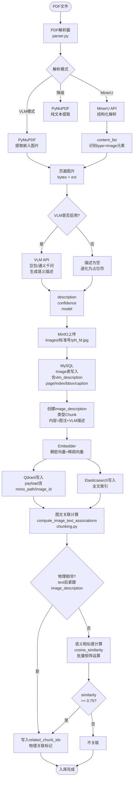
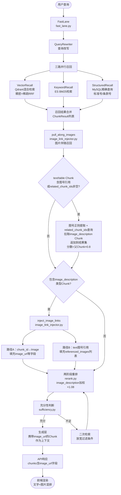

# 29-图片检索增强设计

## 文档元信息

- **文档编号**: 29
- **创建日期**: 2026-07-21
- **最后更新**: 2026-07-22
- **状态**: 设计中
- **关联文档**: 
  - [28-文字PDF-VLM导入设计.md](./28-文字PDF-VLM导入设计.md) - VLM图片处理流水线
  - [10-召回层设计.md](../backend/10-召回层设计.md) - 三路召回架构
  - [06-数据模型设计.md](../backend/06-数据模型设计.md) - Image表结构

---

## 0. 流程图

### 0.1 图片入库流程



### 0.2 图片检索流程



---

## 1. 背景与问题

### 1.1 现状

系统已实现**完整的VLM图片处理流水线**（见28号文档）：

```
PDF解析 → VLM生成描述 → MinIO存储图片 → MySQL记录元数据
         ↓
    创建image_description类型Chunk → 向量化 → Qdrant/ES索引
```

**核心机制**：
- 每张图片的VLM描述被转换为独立Chunk，内容格式为：
  ```
  [图片描述] 第{page}页 图{index+1}：{vlm_description}
  ```
- Chunk与普通文本块同等对待，参与向量检索、关键词检索、结构化检索
- Image表与Chunk表通过 `chunk_id` 外键关联

**已验证能力**：
- 图片描述可被检索到（向量相似度/BM25匹配）
- 图片元数据完整记录（页码、图号、OCR文字、bbox）


### 1.2 存在的问题

当前实现存在三个关键缺陷：

**问题一：检索结果不携带图片链接**

`recall.py` 的 `ChunkResult` 数据结构只有文本字段，无 `image_url` / `image_id`。
当 `content_type == 'image_description'` 时，前端收到的只是 VLM 生成的文字描述，无法展示原图。

```python
# 当前 ChunkResult（精简）
class ChunkResult:
    chunk_id: int
    content: str          # "[图片描述] 第3页 图1：球面压力试验装置..."
    content_type: str     # "image_description"
    # ❌ 缺少：image_id, image_url, page_number, figure_number
```

**问题二：MD文件中的图片路径无法直接用于检索结果**

MinerU导出的MD文件里图片引用格式为：
```markdown

图1 球面压力试验装置
```

入库时这类路径被保存为 MinIO 相对路径（`images/{standard_no}/...`），
但检索结果中不携带该路径，前端无法拼接出完整可访问的 URL。

**问题三：语义相关但无显式图号引用的文本段落无法关联图片**

源文本中存在与图片高度相关的文段，但正文中并未出现"如图N所示"等显式引用。例如：

```
"球面压力试验装置应放置在水平台面上，确保试样中心对准施压点，试验温度保持在75℃..."
（下一个元素是：图1 球面压力试验装置示意图）
```

当该文本段落被召回时，用户无法看到配图，因为：
- 无图号引用，`pull_along_images` 的正则提取无法命中
- `image_description` Chunk 的向量相似度不一定高于召回阈值
- 在线实时做语义匹配成本过高（每次检索需计算全文档图片相似度）

**解决方案**：在**入库时**预计算图文关联，存入 `related_chunk_ids`，检索时直接读取，零延迟。


---

## 2. 方案设计

### 2.1 目标

1. 检索结果中，`image_description` 类型的 Chunk 自动携带图片访问 URL
2. 支持通过 MinIO presigned URL 或代理接口返回图片
3. 召回时可单独控制是否包含图片结果（过滤开关）
4. 前端能渲染图文混排的检索结果
5. **图片伴随召回**：文本 Chunk 被召回时，自动将其引用的图片对应的 `image_description` Chunk 一并拉入结果集，使生成层能读到 VLM 描述并引用图片

### 2.2 总体流程

```
【入库阶段】
文档解析 → 切分 Chunk → Embedding 向量化
  ↓
[新增] 图文关联计算 compute_image_text_associations()
  ├── 物理关联：text Chunk 后紧跟 image_description Chunk → 写入 related_chunk_ids
  └── 语义关联：批量矩阵计算 cosine_similarity，≥ 0.75 → 写入 related_chunk_ids
  ↓
写入 MySQL / Qdrant / ES

【检索阶段】
查询请求
  ↓
三路召回（向量/关键词/结构化）
  ↓
召回结果合并（ChunkResult 列表）
  ↓
[新增 步骤1] 图片伴随召回 pull_along_images()
  ├── 对 text/table Chunk：提取显式图号引用（"图N"）→ 拉取对应 image_description Chunk
  └── 对 text/table Chunk：读取 related_chunk_ids → 拉取语义关联的 image_description Chunk
  ↓
[新增 步骤2] 图片链接注入 inject_image_links()
  ├── 路径 A：image_description Chunk → chunk_id → Image → 填充 image_url 等字段
  └── 路径 B：text Chunk 的显式图号引用 → (document_id, figure_number) → 填充 referenced_images[]
  ↓
重排层（image_description Chunk 加权 ×1.08）
  ↓
生成层 / API 响应（携带 image_url + referenced_images）
```


---

## 3. 数据结构变更

### 3.1 扩展 ChunkResult

**文件**: `backend/app/schemas/retrieval.py`

图片与 Chunk 存在两种关联关系，需要分别处理：

| 场景 | Chunk 类型 | 说明 |
|------|-----------|------|
| A | `image_description` | Chunk 本身就是图片的语义描述，1 对 1 |
| B | `text` / `table` | 文段正文中含有"如图N所示"等图号引用，1 对 多 |

**场景 B 是关键漏洞**：若仅检索到正文文段而未检索到 `image_description` Chunk，图片会丢失。修复方式是在注入层提取正文中的图号引用，反查 Image 表补充图片链接。

```python
class ImageRef(BaseModel):
    """单张图片引用，用于 text Chunk 中的图号反查结果"""
    image_id: int
    image_url: str
    figure_number: Optional[str]  # 图号，如 "图1"
    caption: Optional[str]        # 图注
    page_number: int


class ChunkResult(BaseModel):
    # 原有字段（保持不变）
    chunk_id: int
    document_id: int
    content: str
    content_type: str          # "text" | "table" | "image_description"
    score: float
    document_title: str
    standard_no: Optional[str]
    # ... 其他字段

    # 场景 A：content_type == 'image_description' 时填充，对应单张图片
    image_id: Optional[int] = None
    image_url: Optional[str] = None
    image_page: Optional[int] = None
    image_figure_number: Optional[str] = None
    image_caption: Optional[str] = None

    # 场景 B：text/table Chunk 中的图号引用解析结果（可多张）
    referenced_images: List[ImageRef] = []

    # 语义关联（入库预计算，pull_along_images 读取此字段）
    related_chunk_ids: List[int] = []
```

### 3.2 图片链接注入函数

**文件**: `backend/app/core/retrieval/image_link_injector.py`（新建）

两路注入，一次函数调用完成：

```python
import re
from typing import List
from sqlalchemy.orm import Session

# 图号正则：匹配 "图1"、"图5-2"、"图5.2"、"图 1"
_FIGURE_REF_RE = re.compile(r'图\s*(\d+(?:[.\-]\d+)*)')

async def inject_image_links(
    chunks: List[ChunkResult],
    db: Session,
    url_ttl: int = 3600,
) -> List[ChunkResult]:
    """
    路径 A：image_description Chunk → 查 chunk_id → 注入单张图片字段
    路径 B：text/table Chunk → 提取图号引用 → 查 (document_id, figure_number) → 注入 referenced_images
    两路合并为一次函数调用，内部各做一次 batch DB 查询。
    """
    # ── 路径 A ──────────────────────────────────────────────────
    img_desc_chunks = [c for c in chunks if c.content_type == "image_description"]
    if img_desc_chunks:
        chunk_ids = [c.chunk_id for c in img_desc_chunks]
        imgs_by_chunk = {
            img.chunk_id: img
            for img in db.query(Image).filter(Image.chunk_id.in_(chunk_ids)).all()
        }
        for chunk in img_desc_chunks:
            img = imgs_by_chunk.get(chunk.chunk_id)
            if img:
                chunk.image_id = img.id
                chunk.image_url = _build_image_url(img.minio_path, url_ttl)
                chunk.image_page = img.page_number
                chunk.image_figure_number = img.figure_number
                chunk.image_caption = img.caption

    # ── 路径 B ──────────────────────────────────────────────────
    # 对 text/table Chunk，从 content 中提取图号，反查 Image 表
    text_chunks = [c for c in chunks if c.content_type in ("text", "table")]
    if text_chunks:
        # 收集所有 (document_id, figure_number) 对
        refs: dict[tuple, list] = {}  # (doc_id, fig_no) → [chunk]
        for chunk in text_chunks:
            for match in _FIGURE_REF_RE.finditer(chunk.content):
                fig_no = f"图{match.group(1)}"
                key = (chunk.document_id, fig_no)
                refs.setdefault(key, []).append(chunk)

        if refs:
            # 按 document_id 分组查询（避免笛卡尔积）
            doc_ids = list({k[0] for k in refs})
            fig_nos = list({k[1] for k in refs})
            found_imgs = (
                db.query(Image)
                .filter(
                    Image.document_id.in_(doc_ids),
                    Image.figure_number.in_(fig_nos),
                )
                .all()
            )
            imgs_by_key = {(img.document_id, img.figure_number): img for img in found_imgs}

            for (doc_id, fig_no), target_chunks in refs.items():
                img = imgs_by_key.get((doc_id, fig_no))
                if img:
                    ref = ImageRef(
                        image_id=img.id,
                        image_url=_build_image_url(img.minio_path, url_ttl),
                        figure_number=img.figure_number,
                        caption=img.caption,
                        page_number=img.page_number,
                    )
                    for chunk in target_chunks:
                        chunk.referenced_images.append(ref)

    return chunks
```

### 3.3 图片伴随召回函数

**文件**: `backend/app/core/retrieval/image_link_injector.py`（与 3.2 同文件）

```python
async def pull_along_images(
    chunks: List[ChunkResult],
    db: Session,
    parent_score_ratio: float = 0.8,
) -> List[ChunkResult]:
    """
    图片伴随召回：确保生成层能看到配图，不依赖 image_description Chunk 是否被向量召回。

    两种触发路径：
    1. 显式图号引用：text/table Chunk content 中含 "图N"，正则提取后查 Image 表
    2. 语义关联（入库预计算）：读取 Chunk.related_chunk_ids，直接拉取关联的 image_description Chunk
    """
    def _sync_pull():
        existing_ids = {c.chunk_id for c in chunks}

        # ── 路径1：显式图号引用 ────────────────────────────────────────
        refs: dict[tuple, float] = {}  # (doc_id, fig_no) → 父 chunk 最高分
        for chunk in chunks:
            if chunk.content_type not in ("text", "table"):
                continue
            for match in _FIGURE_REF_RE.finditer(chunk.content):
                fig_no = f"图{match.group(1)}"
                key = (chunk.document_id, fig_no)
                refs[key] = max(refs.get(key, 0.0), chunk.score)

        if refs:
            doc_ids = list({k[0] for k in refs})
            fig_nos = list({k[1] for k in refs})
            images = (
                db.query(Image)
                .filter(Image.document_id.in_(doc_ids), Image.figure_number.in_(fig_nos))
                .all()
            )
            img_chunk_to_fig = {
                img.chunk_id: (img.document_id, img.figure_number)
                for img in images if img.chunk_id and img.chunk_id not in existing_ids
            }
            if img_chunk_to_fig:
                db_chunks = db.query(DBChunk).filter(DBChunk.id.in_(list(img_chunk_to_fig.keys()))).all()
                for dbc in db_chunks:
                    key = img_chunk_to_fig.get(dbc.id)
                    parent_score = refs.get(key, 0.5) if key else 0.5
                    meta = dbc.meta_data or {}
                    chunks.append(ChunkResult(
                        chunk_id=dbc.id,
                        document_id=dbc.document_id,
                        content=dbc.content,
                        content_type="image_description",
                        score=round(parent_score * parent_score_ratio, 4),
                        recall_source="pull_along",
                        document_title=meta.get("document_title", ""),
                        standard_no=meta.get("standard_no"),
                        clause=dbc.clause,
                        page_start=dbc.page_start,
                        page_end=dbc.page_end,
                    ))
                    existing_ids.add(dbc.id)

        # ── 路径2：related_chunk_ids 语义关联 ─────────────────────────
        related_ids_map: dict[int, float] = {}  # chunk_id → 父分数
        for chunk in chunks:
            if chunk.content_type not in ("text", "table"):
                continue
            if not chunk.related_chunk_ids:
                continue
            for rel_id in chunk.related_chunk_ids:
                if rel_id not in existing_ids:
                    related_ids_map[rel_id] = max(related_ids_map.get(rel_id, 0.0), chunk.score)

        if related_ids_map:
            db_chunks = (
                db.query(DBChunk)
                .filter(
                    DBChunk.id.in_(list(related_ids_map.keys())),
                    DBChunk.content_type == "image_description"
                )
                .all()
            )
            for dbc in db_chunks:
                parent_score = related_ids_map.get(dbc.id, 0.5)
                meta = dbc.meta_data or {}
                chunks.append(ChunkResult(
                    chunk_id=dbc.id,
                    document_id=dbc.document_id,
                    content=dbc.content,
                    content_type="image_description",
                    score=round(parent_score * parent_score_ratio, 4),
                    recall_source="pull_along_semantic",
                    document_title=meta.get("document_title", ""),
                    standard_no=meta.get("standard_no"),
                    clause=dbc.clause,
                    page_start=dbc.page_start,
                    page_end=dbc.page_end,
                ))
                existing_ids.add(dbc.id)

        return chunks

    return await asyncio.to_thread(_sync_pull)
```

### 3.4 入库时图文关联计算

**文件**: `backend/app/core/document_processor/chunking.py`（新增函数）

在所有 Chunk 向量化完成后，入库前调用此函数预计算图文关联：

```python
import numpy as np
from typing import List

def compute_image_text_associations(
    chunks: List[DBChunk],
    similarity_threshold: float = 0.75,
) -> None:
    """
    预计算图文关联关系，写入各 text/table Chunk 的 related_chunk_ids。

    关联策略（两路，均写入同一字段，不互斥）：
    1. 物理相邻：text/table Chunk 在文档顺序上紧邻 image_description Chunk
    2. 语义关联：向量余弦相似度 >= threshold

    原地修改 chunks 列表中各 Chunk 的 related_chunk_ids 字段。

    Args:
        chunks: 同一文档内按 position_index 排序的所有 Chunk 列表
        similarity_threshold: 语义关联阈值（默认 0.75）
    """
    text_chunks = [c for c in chunks if c.content_type in ("text", "table")]
    img_chunks  = [c for c in chunks if c.content_type == "image_description"]

    if not text_chunks or not img_chunks:
        return

    def _add_related(chunk: DBChunk, rel_id: int) -> None:
        if chunk.related_chunk_ids is None:
            chunk.related_chunk_ids = []
        if rel_id not in chunk.related_chunk_ids:
            chunk.related_chunk_ids.append(rel_id)

    # ── 物理相邻关联 ──────────────────────────────────────────────────
    for i, chunk in enumerate(chunks[:-1]):
        if chunk.content_type in ("text", "table") and \
           chunks[i + 1].content_type == "image_description":
            _add_related(chunk, chunks[i + 1].id)

    # ── 语义关联（批量矩阵余弦相似度）────────────────────────────────
    # 需要 dense_vector 已写入，若不存在则跳过
    text_vecs = [c.dense_vector for c in text_chunks if c.dense_vector]
    img_vecs  = [c.dense_vector for c in img_chunks  if c.dense_vector]

    if not text_vecs or not img_vecs:
        return

    # numpy 矩阵运算：(n_text, dim) × (dim, n_img) → (n_text, n_img)
    T = np.array(text_vecs, dtype=np.float32)
    I = np.array(img_vecs,  dtype=np.float32)

    # L2 归一化
    T /= np.linalg.norm(T, axis=1, keepdims=True) + 1e-8
    I /= np.linalg.norm(I, axis=1, keepdims=True) + 1e-8

    sim_matrix = T @ I.T  # shape: (n_text, n_img)

    valid_text = [c for c in text_chunks if c.dense_vector]
    valid_img  = [c for c in img_chunks  if c.dense_vector]

    for i, text_chunk in enumerate(valid_text):
        for j, img_chunk in enumerate(valid_img):
            if sim_matrix[i, j] >= similarity_threshold:
                _add_related(text_chunk, img_chunk.id)
```

---

## 4. 图片 URL 策略

### 4.1 两种访问方式对比

| 方式 | 实现 | 优点 | 缺点 |
|------|------|------|------|
| **MinIO Presigned URL** | `minio_client.presigned_get_object(bucket, path, expires)` | 无需代理，直链访问，性能好 | URL 有过期时间，缓存须注意 |
| **后端代理接口** | `GET /api/v1/images/{image_id}` → 后端从 MinIO 取流再返回 | URL 永久有效，便于鉴权 | 多一跳，占用后端带宽 |

**推荐**：优先用 presigned URL（TTL 1小时），前端缓存响应时不存储 URL 本身。

### 4.2 URL 生成逻辑

```python
def _build_image_url(minio_path: str, ttl: int) -> Optional[str]:
    """
    minio_path 格式：images/{standard_no}/p{page}_{index}.{ext}
    返回带签名的临时访问 URL，失败返回 None
    """
    from app.storage.object_store import object_store
    return object_store.get_image_url(minio_path, expires_seconds=ttl)
```

### 4.3 Chunk Payload 中预存路径

图片 Chunk 入库时，在 Qdrant payload 和 ES 文档中也存入 `minio_path`，
这样检索层可以**不查 PostgreSQL** 直接拼 URL，减少一次 DB 查询（可选优化）。

```python
# ingestion_pipeline.py _process_images() 中，Qdrant payload 扩展
payload = {
    "chunk_id": chunk_id,
    "content_type": "image_description",
    "minio_path": object_name,     # 新增
    "image_id": image_id,          # 新增
    "page_number": img_info["page"],
    "figure_number": caption_text,
    ...
}
```


---

## 5. 召回层集成点

### 5.1 fast_lane.py 中集成图片召回与链接注入

`pull_along_images()` 和 `inject_image_links()` 在三路召回合并后、重排之前依次调用：

```python
# retrieval/fast_lane.py  execute() 方法中

# 1. 三路召回合并
merged = self._merge_results(vector_results, keyword_results, structured_results)

# 2. 图片伴随召回（新增）：拉取显式图号引用 + related_chunk_ids 关联的图片 Chunk
merged = await pull_along_images(merged, self.db)

# 3. 图片链接注入（新增）：为 image_description Chunk 填充 image_url，为 text Chunk 填充 referenced_images
merged = await inject_image_links(merged, self.db)

# 4. 两阶段重排
reranked = await self.reranker.rerank(query, merged)
```

### 5.2 图片结果过滤开关

在 `QueryRequest` 中增加可选参数：

```python
class QueryRequest(BaseModel):
    query: str
    include_images: bool = True   # 是否在检索结果中包含图片
    image_only: bool = False      # 仅返回图片结果（图片检索场景）
```

在召回层对应过滤：

```python
if not request.include_images:
    merged = [c for c in merged if c.content_type != "image_description"]
elif request.image_only:
    merged = [c for c in merged if c.content_type == "image_description"]
```

### 5.3 重排层图片权重

图片描述 Chunk 在重排时给予适当提权，防止纯文本偏置导致图片沉底：

```python
# rerank.py  _apply_type_boost()
TYPE_BOOST = {
    "text": 1.0,
    "table": 1.05,
    "image_description": 1.08,  # 工程标准中图表信息量高
}
```


---

## 6. MD 文件图片路径处理

当前 MinerU 导出的 MD 文件中图片引用格式：
```markdown

图1 球面压力试验装置
```

### 6.1 入库时的处理规则

解析 MD 文件时，扫描所有 `` 引用：

1. **hash 文件名 → MinIO 路径映射**：
   - 原始路径：`images/{hash}.jpg`
   - MinIO 目标路径：`images/{standard_no}/p{page}_{index}.jpg`
   - 建立映射表，入库后写入 Image 表的 `meta_data.original_hash`

2. **图注提取**：图片后紧跟的文字（`图N ...` 格式）提取为 `caption` 和 `figure_number`

3. **Chunk 内容增强**：将图注合并入 image_description Chunk：
   ```
   [图片描述] 第3页 图1 球面压力试验装置：{vlm_description}
   ```
   这样检索"球面压力试验装置"时也能命中该图片。

### 6.2 检索时的 MD 内容处理

生成层引用 Chunk 时，若 `content_type == 'image_description'`，
在生成的回答中插入图片占位符，前端再替换为 `` 标签：

```
回答文本中：
  ...球面压力试验装置如图所示。
  [[IMAGE:image_id=42,url=https://...]]
  该试验装置由...
```


---

## 7. API 响应格式

### 7.1 检索结果中的图片字段

```json
{
  "chunks": [
    {
      "chunk_id": 1024,
      "content": "[图片描述] 第3页 图1 球面压力试验装置：图示为一个金属试验台架，中央放置圆形试样，上方有垂直施压的钢球装置，旁边有温度计示数指示75℃。",
      "content_type": "image_description",
      "score": 0.87,
      "document_title": "起重冶金和屏蔽电机安全要求",
      "standard_no": "GB 20237-2006",
      "image_id": 42,
      "image_url": "https://minio.example.com/documents/images/GB20237-2006/p3_0.jpg?X-Amz-Signature=...",
      "image_page": 3,
      "image_figure_number": "图1",
      "image_caption": "球面压力试验装置"
    }
  ]
}
```

### 7.2 后端代理接口（备用）

```
GET /api/v1/images/{image_id}
Authorization: Bearer {token}

Response: image/jpeg binary stream
```

用于不希望前端直接访问 MinIO 的部署场景（内网隔离、统一鉴权）。


---

## 8. 实施计划

### P0 — 让图片检索结果可回显（必做）

| 步骤 | 文件 | 变更内容 |
|------|------|----------|
| 1 | `schemas/retrieval.py` | `ChunkResult` 新增 `content_type / image_id / image_url / image_page / image_figure_number / image_caption / referenced_images` 字段；新增 `ImageRef` 模型 |
| 2 | `core/retrieval/image_link_injector.py` | 新建，实现 `inject_image_links()`（路径A+B）和 `pull_along_images()`（显式图号+related_chunk_ids两路） |
| 3 | `core/retrieval/fast_lane.py` | 召回合并后依次调用 `pull_along_images()` → `inject_image_links()` |
| 4 | `storage/object_store.py` | 确认 `get_image_url()` 可用（已实现，无需修改） |

### P1 — 入库时预计算图文关联（提升语义召回覆盖率）

| 步骤 | 文件 | 变更内容 |
|------|------|----------|
| 5 | `core/document_processor/chunking.py` | 新增 `compute_image_text_associations()`：物理相邻 + 批量余弦相似度（≥0.75）写入 `related_chunk_ids` |
| 6 | `core/document_processor/chunking.py` | 在 Chunk 向量化完成、写库之前调用步骤5的函数 |
| 7 | `core/ingestion_pipeline.py` | Qdrant/ES payload 写入 `minio_path` 和 `image_id`，便于检索层不查 DB 直接拼 URL |
| 8 | `core/ingestion_pipeline.py` | 图注文字合并入 Chunk content，提升关键词召回覆盖率 |

### P2 — 重排与完善

| 步骤 | 文件 | 变更内容 |
|------|------|----------|
| 9 | `core/retrieval/rerank.py` | 对 `image_description` 类型加 ×1.08 权重，防止纯文本偏置导致图片沉底 |
| 10 | `api/v1/endpoints/images.py` | 新建代理接口 `GET /images/{image_id}`（内网隔离部署备用） |
| 11 | `schemas/query.py` | `QueryRequest` 增加 `include_images / image_only` 参数 |
| 12 | 前端 | 识别 `[[IMAGE:...]]` 占位符并渲染 `` 标签，实现图文混排 |

---

## 9. 注意事项

- **presigned URL 缓存**：前端请求中不应缓存 URL 本身（URL 含签名会过期），应缓存图片 blob
- **Image 表关联完整性**：入库时若 VLM 调用失败（`vlm_description` 为空），图片仍应入库 Image 表，只是描述字段为空，Chunk 内容退化为 `[图片] 第N页 图M`，仍可被结构化检索命中
- **OCR 文字利用**：`Image.ocr_text` 字段目前未被向量化，可在 P2 阶段将其追加到 image_description Chunk 的内容末尾，实现"图内文字搜索"
- **Hash 文件名唯一性**：MinerU 以图片内容哈希命名，同一张图在不同文档中重复出现时哈希相同，入库时需用 `(document_id, page_number, image_index)` 唯一键去重（Image 表已有此 UniqueConstraint）


